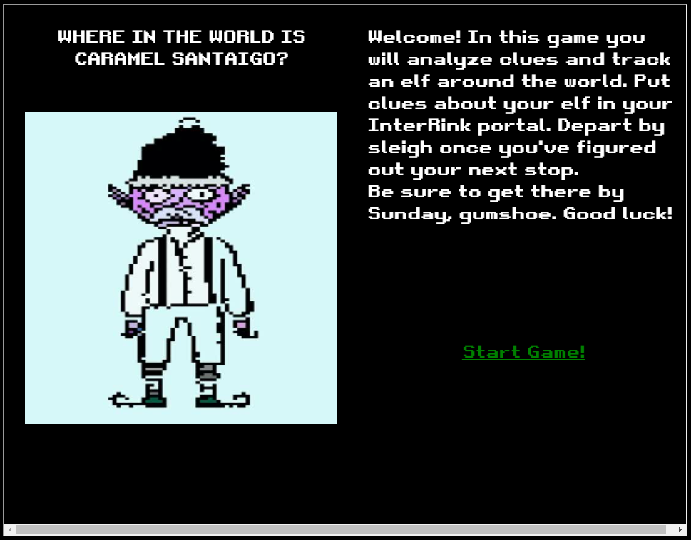

# Challenge 2: Where in the World is Caramel Santaigo?

> Help Tangle Coalbox find a wayward elf in Santa's courtyard. Talk to Piney Sappington nearby for hints.

## The Hint

We can find Piney behind the castle in the courtyard. Here's what he has to say:

> Hi ho, Piney Sappington at your service!
> Well, honestly, I could use a touch of your services.
>
>You see, I've been looking at these documents, and I know someone has tampered with one file.
>
>Do you think you could log into this Cranberry Pi and take a look?
>
>It has exiftool installed on it, if that helps you at all.
>
>I just... Well, I have a feeling that someone at that other conference might have fiddled with things.
>
>And, if you help me figure this tampering issue out, I’ll give you some hints about OSINT, especially associated with geographic locations!

Opening the nearby console gives us the following prompt:

> HELP! That wily Jack Frost modified one of our naughty/nice records, and right before Christmas! Can you help us figure out which one? We've installed exiftool for your convenience!

`exiftool` is a handy tool that will enable us to read and write meta information in files. Listing the contents of our
current directory, we see a handful of files:

```bash
elf@fbb1b0f8b804:~$ ls -al                                                                [5/5]
total 420                                                                                      
drwxr-xr-x 1 elf  elf   4096 Dec  8 03:10 .                                                    
drwxr-xr-x 1 root root  4096 Dec  4 18:49 ..                                                   
-rw-r--r-- 1 elf  elf    220 Aug  4 20:25 .bash_logout                                         
-rw-r--r-- 1 elf  elf     27 Nov 23 15:48 .bashrc                                              
-rw-r--r-- 1 elf  elf    807 Aug  4 20:25 .profile
-rw-r--r-- 1 elf  elf  13418 Nov 23 15:48 2021-12-01.docx
-rw-r--r-- 1 elf  elf  13420 Nov 23 15:48 2021-12-02.docx
-rw-r--r-- 1 elf  elf  13426 Nov 23 15:48 2021-12-03.docx
-rw-r--r-- 1 elf  elf  13384 Nov 23 15:48 2021-12-04.docx
-rw-r--r-- 1 elf  elf  13469 Nov 23 15:48 2021-12-05.docx
-rw-r--r-- 1 elf  elf  13436 Nov 23 15:48 2021-12-06.docx
-rw-r--r-- 1 elf  elf  13420 Nov 23 15:48 2021-12-07.docx
-rw-r--r-- 1 elf  elf  13364 Nov 23 15:48 2021-12-08.docx
-rw-r--r-- 1 elf  elf  13396 Nov 23 15:48 2021-12-09.docx
-rw-r--r-- 1 elf  elf  13414 Nov 23 15:48 2021-12-10.docx
-rw-r--r-- 1 elf  elf  13411 Nov 23 15:48 2021-12-11.docx
-rw-r--r-- 1 elf  elf  13402 Nov 23 15:48 2021-12-12.docx
-rw-r--r-- 1 elf  elf  13425 Nov 23 15:48 2021-12-13.docx
-rw-r--r-- 1 elf  elf  13454 Nov 23 15:48 2021-12-14.docx
-rw-r--r-- 1 elf  elf  13438 Nov 23 15:48 2021-12-15.docx
-rw-r--r-- 1 elf  elf  13369 Nov 23 15:48 2021-12-16.docx
-rw-r--r-- 1 elf  elf  13398 Nov 23 15:48 2021-12-17.docx
-rw-r--r-- 1 elf  elf  13415 Nov 23 15:48 2021-12-18.docx
-rw-r--r-- 1 elf  elf  13383 Nov 23 15:48 2021-12-19.docx
-rw-r--r-- 1 elf  elf  13409 Nov 23 15:48 2021-12-20.docx
-rw-r--r-- 1 elf  elf  13519 Nov 23 15:48 2021-12-21.docx
-rw-r--r-- 1 elf  elf  13387 Nov 23 15:48 2021-12-22.docx
-rw-r--r-- 1 elf  elf  13414 Nov 23 15:48 2021-12-23.docx
-rw-r--r-- 1 elf  elf  13411 Nov 23 15:48 2021-12-24.docx
-rw-r--r-- 1 elf  elf  13449 Nov 23 15:48 2021-12-25.docx
```

We can combine `exiftool` and `grep` to help identify the suspect file:

```bash
elf@fbb1b0f8b804:~$ exiftool * | grep "^Modify"                                               
Modify Date                     : 2021:12:01 00:00:00Z
Modify Date                     : 2021:12:02 00:00:00Z
Modify Date                     : 2021:12:03 00:00:00Z
Modify Date                     : 2021:12:04 00:00:00Z
Modify Date                     : 2021:12:05 00:00:00Z
Modify Date                     : 2021:12:06 00:00:00Z
Modify Date                     : 2021:12:07 00:00:00Z
Modify Date                     : 2021:12:08 00:00:00Z
Modify Date                     : 2021:12:09 00:00:00Z
Modify Date                     : 2021:12:10 00:00:00Z
Modify Date                     : 2021:12:11 00:00:00Z
Modify Date                     : 2021:12:12 00:00:00Z
Modify Date                     : 2021:12:13 00:00:00Z
Modify Date                     : 2021:12:14 00:00:00Z
Modify Date                     : 2021:12:15 00:00:00Z
Modify Date                     : 2021:12:16 00:00:00Z
Modify Date                     : 2021:12:17 00:00:00Z
Modify Date                     : 2021:12:18 00:00:00Z
Modify Date                     : 2021:12:19 00:00:00Z
Modify Date                     : 2021:12:20 00:00:00Z
Modify Date                     : 2021:12:24 23:59:59Z
Modify Date                     : 2021:12:22 00:00:00Z
Modify Date                     : 2021:12:23 00:00:00Z
Modify Date                     : 2021:12:24 00:00:00Z
Modify Date                     : 2021:12:25 00:00:00Z
```

We can see that five entries from the bottom we have a file that was modified just before midnight on Christmas Eve.
This corresponds with `2021-12-21.docx` which is our answer. After submitting, here's what Piney has to say:

> Wow, you figured that out in no time! Thanks!
>
>I knew they were up to no good.
>
>So hey, have you tried the Caramel Santaigo game in this courtyard?
>
>Carmen? No, I haven't heard of her.
>
>So anyway, some of the hints use obscure coordinate systems like MGRS and even what3words.
>
>In some cases, you might get an image with location info in the metadata. Good thing you know how to see that stuff now!
>
>(And they say, for those who don't like gameplay, there might be a way to bypass by looking at some flavor of cookie...)
>
>And Clay Moody is giving a talk on OSINT techniques right now!
>
>Oh, and don't forget to learn about your target elf and filter in the Interrink system!

## The Main Challenge

We can skip over to talk to Tangle Coalbox who is standing just next to the Caramel Santaigo terminal:

> Hey there, Gumshoe. Tangle Coalbox here again.
>
>I've got a real doozy of a case for you this year.
>
>Turns out some elves have gone on some misdirected journeys around the globe. It seems that someone is messing with their travel plans.
>
>We could sure use your open source intelligence (OSINT) skills to find them.
>
>Why dontcha' log into this vintage Cranberry Pi terminal and see if you have what it takes to track them around the globe.
>
>If you're having any trouble with it, you might ask Piney Sappington right over there for tips.

Logging into the terminal, we get the following prompt:



If we recall from earlier, Piney gave us a hint about bypassing the game by leveraging a cookie. Taking a look at our
cookies in the chrome developer view, we can see that we do indeed have an interesting looking cookie:

```
eJx1UsFu2zAM_RVCZ2Owk7SNc9uyDWvRoUUaoIekB1qibS2yaEhysqzov49qt8OA7mTpPb73SMrPyuBZrdQjGU8xnwtFrhXkhk7k4Ja7zvr4hn6zPkW12qltTyB3GMgny54MRB4o9dZ3gA1PCR4S6gPcHSm0jk-A3sD9OfXsP4jVX3nHCQKhc2foCZPYvImnmI3iiJoitBzAeiNJMWvv-gKuwXOyWupTT6JFEebEAI8YYgYH4UZJI9AYKet6DEY9yZenINPNZoI51pj7l_uWD2cu4AZH9MLwmPE8607dsjfsC_jiOydzCHsfsJuogPUv0j1saJwaZ7UQ39mnsJ_Kkmp0wqNHg5K6U2seyffYkRh9Jj9gOEj9R59OFMYCPpHr7DQItOEjekuDLeCr9a-BWb-h8-EHHl-9zUFWoOlPM-9nSpNO1tezMxTUkwwepJyHByKjVstlKYCsmvJr_necd9r7x7VQR6sTh7Nsj_IWn-UtYr_aq-qqXBiaU6uxqbCulkQX2JSLel63aOiC9HKpK305b7GsFu2lLhtztahnQtZl01Z7VcifEeWtNF2bFezVFmX9BGtG1_DPvXpRL78B7MXowQ
```

In our hints tab, we see a link to
a [gist that details how to decode flask cookies](https://gist.github.com/chriselgee/b9f1861dd9b99a8c1ed30066b25ff80b).
We can leverage this to decode details about our game and solve this challenge.

```python
import json
import zlib;
import itsdangerous

if __name__ == '__main__':
    cookie = "eJx1UsFu2zAM_RVCZ2Owk7SNc9uyDWvRoUUaoIekB1qibS2yaEhysqzov49qt8OA7mTpPb73SMrPyuBZrdQjGU8xnwtFrhXkhk7k4Ja7zvr4hn6zPkW12qltTyB3GMgny54MRB4o9dZ3gA1PCR4S6gPcHSm0jk-A3sD9OfXsP4jVX3nHCQKhc2foCZPYvImnmI3iiJoitBzAeiNJMWvv-gKuwXOyWupTT6JFEebEAI8YYgYH4UZJI9AYKet6DEY9yZenINPNZoI51pj7l_uWD2cu4AZH9MLwmPE8607dsjfsC_jiOydzCHsfsJuogPUv0j1saJwaZ7UQ39mnsJ_Kkmp0wqNHg5K6U2seyffYkRh9Jj9gOEj9R59OFMYCPpHr7DQItOEjekuDLeCr9a-BWb-h8-EHHl-9zUFWoOlPM-9nSpNO1tezMxTUkwwepJyHByKjVstlKYCsmvJr_necd9r7x7VQR6sTh7Nsj_IWn-UtYr_aq-qqXBiaU6uxqbCulkQX2JSLel63aOiC9HKpK305b7GsFu2lLhtztahnQtZl01Z7VcifEeWtNF2bFezVFmX9BGtG1_DPvXpRL78B7MXowQ"
    data: dict = json.loads(zlib.decompress(itsdangerous.base64_decode(cookie)).decode())
    for key, value in data.items():
        print(f"{key}: {value}")
```

This produces the following output:

```
elf: Ginger Breddie
elfHints: ['They kept checking their Slack app.', 'The elf mentioned something about Stack Overflow and Rust.', 'Oh, I noticed they had a Star Trek themed phone case.', 'The elf got really heated about using spaces for indents.', 'hard']
location: Santa's Castle
options: [['Edinburgh, Scotland', 'Rovaniemi, Finland', 'Tokyo, Japan'], ['Edinburgh, Scotland', 'Reykjavík, Iceland', 'London, England'], ['Vienna, Austria', 'Reykjavík, Iceland', 'Rovaniemi, Finland'], ['Placeholder', 'New York, USA', 'Reykjavík, Iceland']]
randomSeed: 537
route: ['Rovaniemi, Finland', 'London, England', 'Reykjavík, Iceland', 'Placeholder']
victoryToken: { hash:"a1a778629103fad77a2e977ea3c482810c1e5c97046e57e55b7812f629b3f06b", resourceId: "79d66227-9d3d-4f3d-ac8f-c8e25b9a4056"}
```

We can now follow the route and select `Ginger Breddie` to win this challenge.

