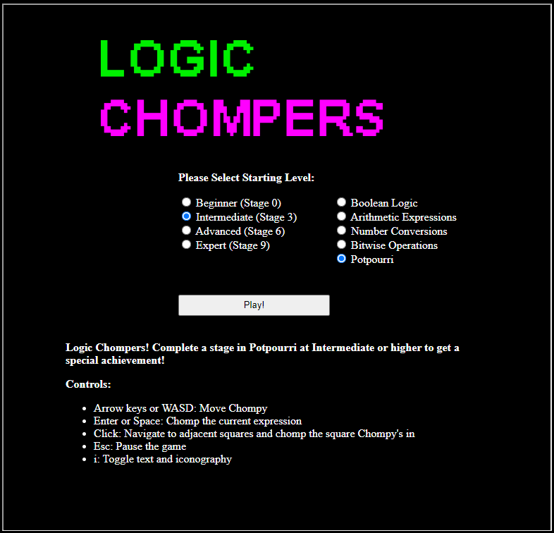
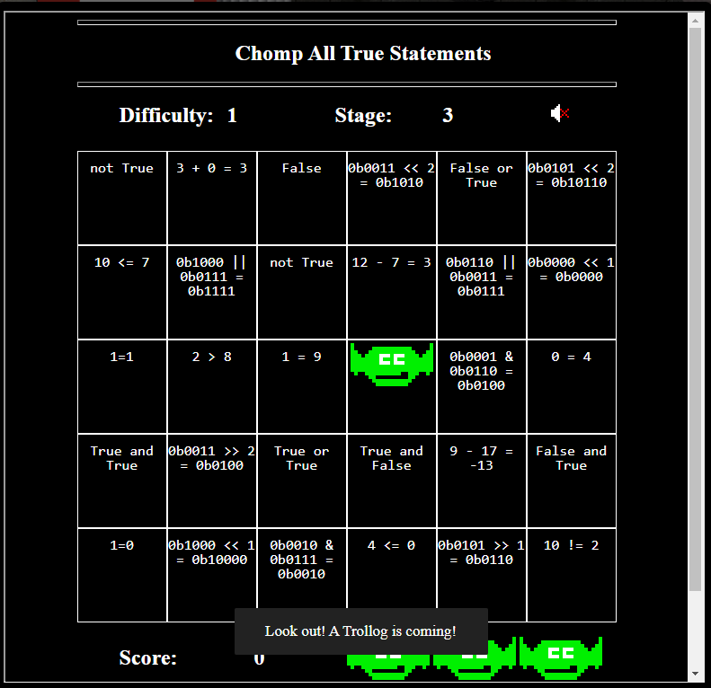
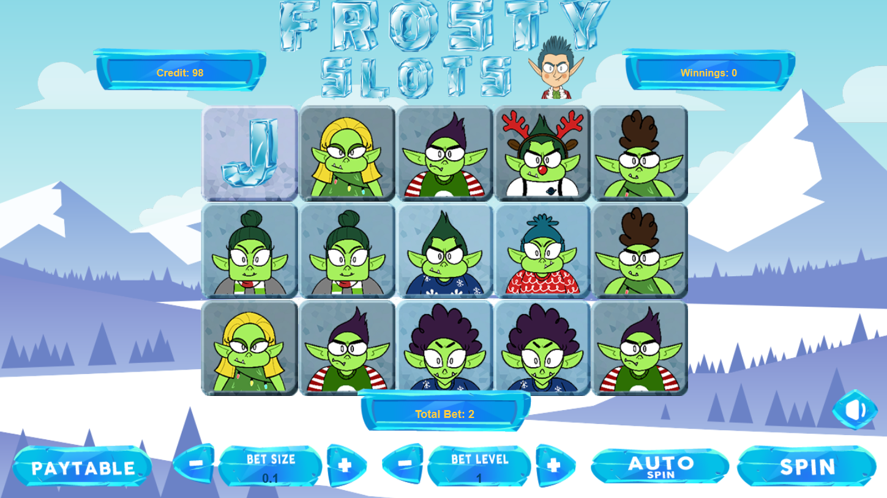
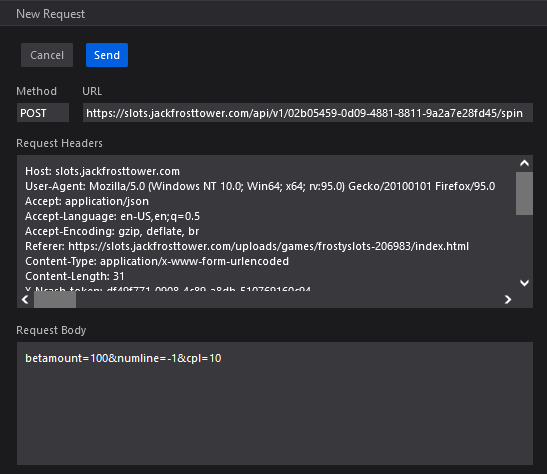

# Challenge 4: Slot Machine Investigation

> Test the security of Jack Frost's slot machines. What does the Jack Frost Tower casino security team threaten to do when your coin total exceeds 1000? Submit the string in the server data.response element. Talk to Noel Boetie outside Santa's Castle for help.

## The Hint

Here's what Noel has to say:

> Hello there! Noel Boetie here. We’re all so glad to have you attend KringleCon IV and work on the Holiday Hack Challenge!
>
> I'm just hanging out here by the Logic Munchers game.
>
> You know… logic: that thing that seems to be in short supply at the tower on the other side of the North Pole?
>
> Oh, I'm sorry. That wasn't terribly kind, but those frosty souls do confuse me...
>
> Anyway, I’m working my way through this Logic Munchers game.
>
> A lot of it comes down to understanding boolean logic, like True And False is False, but True And True is True.
>
> It can get a tad complex in the later levels.
>
> I need some help, though. If you can show me how to complete a stage in Potpourri at the Intermediate (Stage 3) or higher, I’ll give you some hints for how to find vulnerabilities.
>
> Specifically, I’ll give you some tips in finding flaws in some of the web applications I’ve heard about here at the North Pole, especially those associated with slot machines!

Diving into the terminal, let's fire up an intermediate Potpourri challenge:



Launching the game, we see we are faced with a board filled with logical expressions. We need to identify the
expressions that evaluate to `True` to win:



Most of the problems deal with either simple addition/subtraction, or boolean bitwise logic. Working our way through the
board we can `chomp` each true statement to solve this challenge.

Here's what Noel has to say:

> Wow - amazing score! Great work!
>
> So hey, those slot machines. It seems that in his haste, Jack bought some terrible hardware.
>
> It seems they're susceptible to parameter tampering.
>
> You can modify web request parameters with an intercepting proxy or tools built into Firefox.

## The Main Challenge

Opening up the `Frosty Slots` terminal, we are faced with a standard looking slot machine game:



If we take a look at the network tab in Firefox, we see that when we spin, a `POST` request is sent with the following
payload:

```
betamount=1&numline=20&cpl=0.1
```

Let's try tweaking some of these fields. In Firefox, we can replay a modified request by right clicking the request in
the network tab and selecting `Edit and Resend`. Let's modify the numline to be `-1`, and up the `betamount` and `cpl`
parameters and see what happens:



Upon sending our request, we get the following response, and the answer to this challenge:

```json
{
  "success": true,
  "data": {
    "credit": 1098,
    "jackpot": 0,
    "free_spin": 0,
    "free_num": 0,
    "scaler": 0,
    "num_line": -1,
    "bet_amount": 100,
    "pull": {
      "WinAmount": 0,
      "FreeSpin": 0,
      "WildFixedIcons": [],
      "HasJackpot": false,
      "HasScatter": false,
      "WildColumIcon": "",
      "ScatterPrize": 0,
      "SlotIcons": [
        "icon9",
        "icon1",
        "wild",
        "icon6",
        "icon8",
        "scatter",
        "icon4",
        "icon2",
        "scatter",
        "icon10",
        "icon1",
        "icon9",
        "icon7",
        "icon9",
        "icon6"
      ],
      "ActiveIcons": [],
      "ActiveLines": []
    },
    "response": "I'm going to have some bouncer trolls bounce you right out of this casino!"
  },
  "message": "Spin success"
}
```
