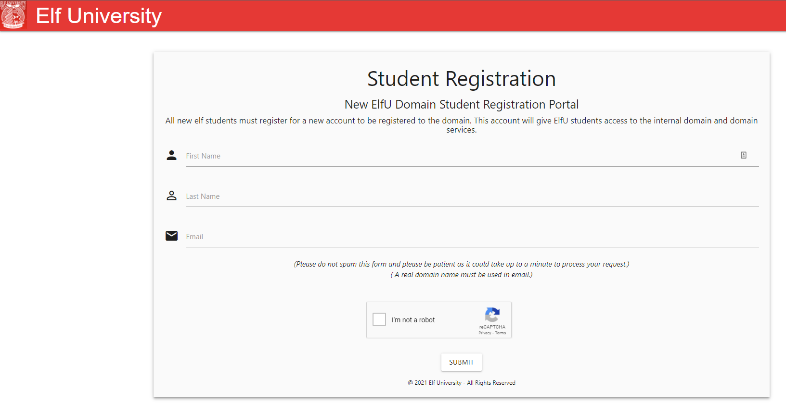
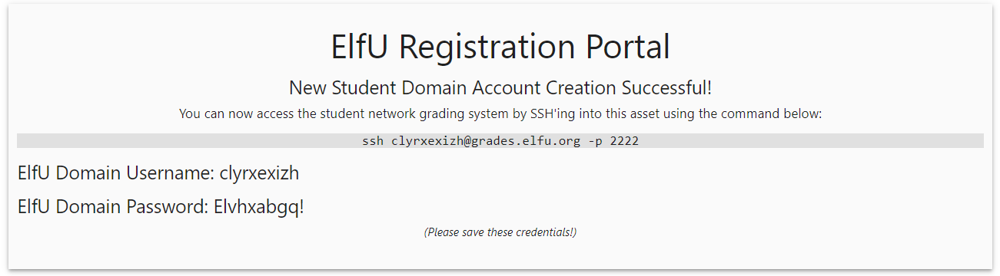

# Challenge 8: Kerberoasting on an Open Fire

> Obtain the secret sleigh research document from a host on the Elf University domain. What is the first secret ingredient Santa urges each elf and reindeer to consider for a wonderful holiday season? Start by registering as a student on the ElfU Portal. Find Eve Snowshoes in Santa's office for hints.

## The Hint

> Here's what Eve has to say:
>
> Hey there, how's it going? I'm Eve Snowshoes.
>
> Lately I've been spending a lot of cycles worrying about what's going on next door.
>
> Before that, I was checking out Fail2Ban.
>
> It's this slick log scanning tool for Apache web servers.
>
> If you can complete this terminal challenge, I’d be happy to give you some things I’ve learned about Kerberoasting and Active Directory permissions!
>
> Why don't you do some work with Fail2Ban on this Cranberry Pi terminal first, then we’ll talk Kerberoasting and Active Directory. OK?

After launching the terminal challenge, we get the following prompt:

```bash
Jack is trying to break into Santa's workshop!

Santa's elves are working 24/7 to manually look through logs, identify the
malicious IP addresses, and block them. We need your help to automate this so
the elves can get back to making presents!

Can you configure Fail2Ban to detect and block the bad IPs?

 * You must monitor for new log entries in /var/log/hohono.log
 * If an IP generates 10 or more failure messages within an hour then it must
   be added to the naughty list by running naughtylist add <ip>
        /root/naughtylist add 12.34.56.78
 * You can also remove an IP with naughtylist del <ip>
        /root/naughtylist del 12.34.56.78
 * You can check which IPs are currently on the naughty list by running
        /root/naughtylist list

You'll be rewarded if you correctly identify all the malicious IPs with a
Fail2Ban filter in /etc/fail2ban/filter.d, an action to ban and unban in
/etc/fail2ban/action.d, and a custom jail in /etc/fail2ban/jail.d. Don't
add any nice IPs to the naughty list!

*** IMPORTANT NOTE! ***

Fail2Ban won't rescan any logs it has already seen. That means it won't
automatically process the log file each time you make changes to the Fail2Ban
config. When needed, run /root/naughtylist refresh to re-sample the log file
and tell Fail2Ban to reprocess it.

root@bd2f56d04e0f:~#
```

Our task is to build the proper fail2ban configuration to stop all the malicious activity being logged
in `/var/log/hohono.log`. Taking a quick look at the log file in question, we can see the following types of failures:

```
2021-12-27 05:49:54 Login from 42.36.105.164 rejected due to unknown user name
2021-12-27 05:49:58 90.201.63.125 sent a malformed request
2021-12-27 05:51:14 Failed login from 67.190.93.176 for chimney
2021-12-27 07:01:52 Invalid heartbeat 'charlie' from 49.136.27.16
```

We can use these failures to help craft the following `jail`, `filter`, and `action` configuration files:

```bash
# /etc/fail2ban/jail.d/hohono.conf
[hohono]
enabled = true
logpath = /var/log/hohono.log
maxretry = 10
findtime = 1h
bantime = 1h
filter = hohono
action = hohono
```

```bash
# /etc/fail2ban/filter.d/hohono.conf
[Definition]
failregex = Failed login from <HOST> for .+$
            <HOST> sent a malformed request$
            Login from <HOST> rejected due to unknown user name$
            Invalid heartbeat '.+' from <HOST>$
```

```bash
# /etc/fail2ban/action.d/hohono.conf
[Definition]
actionban = /root/naughtylist add <ip>
actionunban = /root/naughtylist del <ip>
```

Once our configuration is in place, we can restart fail2ban and refresh our `hohono.log` to trigger a success:

```bash
# service fail2ban restart
# /root/naughtylist refresh
```

Here's what Eve has to say:

> Fantastic! Thanks for the help!
> 
> Hey, would you like to know more about Kerberoasting and Active Directory permissions abuse?
> 
> There's a great talk by Chris Davis on this exact subject!
> 
> There are also plenty of resources available to learn more about Kerberoasting specifically.
> 
> If you have any trouble finding the domain controller on the 10.X.X.X network, remember that, when not running as root, nmap default probing relies on connecting to TCP 80 and 443.
> 
> Got a hash that won't crack with your wordlist? OneRuleToRuleThemAll.rule is a great way to grow your keyspace.
> 
> Where'd you get your wordlist? CeWL might generate a great wordlist from the ElfU website, but it will ignore digits in terms by default.
> 
> So, apropos of nothing, have you ever known system administrators who store credentials in scripts? I know, I know, you understand the folly and would never do it!
> 
> The easy way to investigate Active Directory misconfigurations (for Blue and Red alike!) is with Bloodhound, but there are native methods as well.
> 
> Oh, and one last thing: once you've granted permissions to your user, it might take up to five minutes for it to propogate throughout the domain.

## The Main Challenge

We can head to the [ElfU Portal](https://register.elfu.org/register) to get started on this task.  We are faced with a registration form:



Once registered, we are provided with some ssh credentials:

