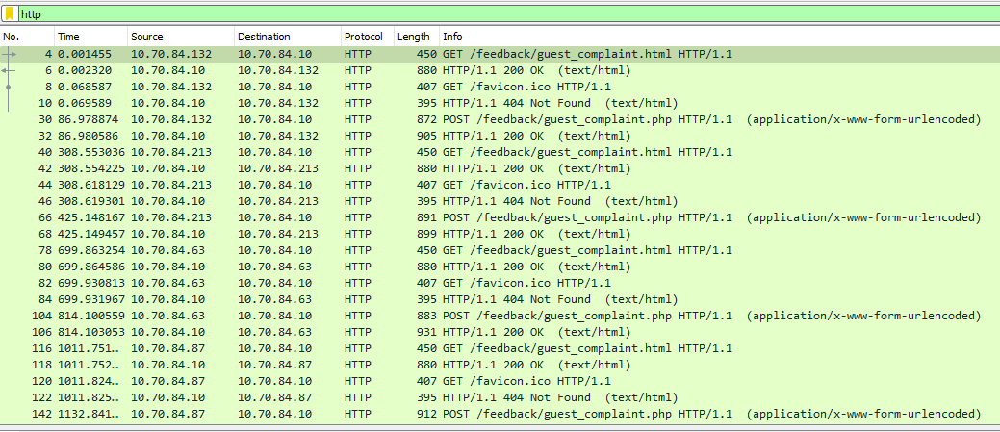
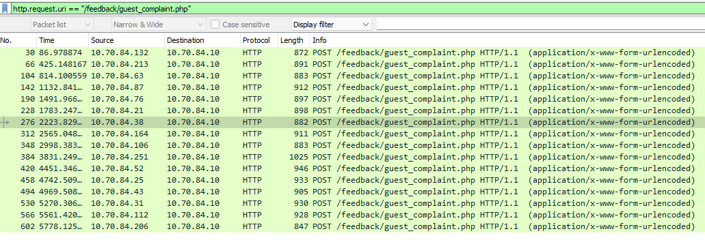
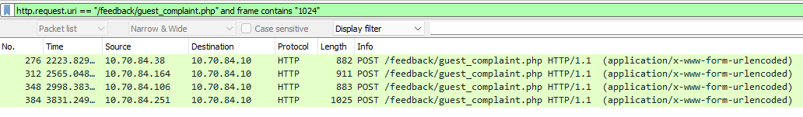

# Challenge 11: Customer Complaint Analysis

> A human has accessed the Jack Frost Tower network with a non-compliant host. Which three trolls complained about the human? Enter the troll names in alphabetical order separated by spaces. Talk to Tinsel Upatree in the kitchen for hints.

## The Hint

Let's head over to the Kitchen to talk to Tinsel:

> Hiya hiya, I'm Tinsel Upatree!
>
> Say, do you know what's going on next door?
>
> I'm a bit worried about the whole FrostFest event.
>
> It feels a bit... ill-conceived, somehow. Nasty even.
>
> Well, regardless – and more to the point, what do you know about tracing processes in Linux?
>
> We rebuilt this here Cranberry Pi that runs the cotton candy machine, but we seem to be missing a file.
>
> Do you think you can use strace or ltrace to help us rebuild the missing config?
>
> We'd like to help some of our favorite children enjoy the sweet spun goodness again!
>
> And, if you help me with this, I’ll give you some hints about using Wireshark filters to look for unusual options that might help you achieve Objectives here at the North Pole.

Firing up the nearby terminal, we get the following prompt:

```bash
================================================================================

Please, we need your help! The cotton candy machine is broken!

We replaced the SD card in the Cranberry Pi that controls it and reinstalled the
software. Now it's complaining that it can't find a registration file!

Perhaps you could figure out what the cotton candy software is looking for...

================================================================================

kotton_kandy_co@1b4e6e995c89:~$
```

Attempting to run `make_the_candy` yields the following result:

```bash
kotton_kandy_co@1b4e6e995c89:~$ ./make_the_candy 
Unable to open configuration file.
```

Looks like we may be missing a configuration file. We can utilize strace to see what syscalls are being executed behind
the scenes:

```bash
kotton_kandy_co@1b4e6e995c89:~$ strace ./make_the_candy 
```

If we read carefully through the output, we can spot an `openat` syscall that seems to be our offending call:

```bash
openat(AT_FDCWD, "registration.json", O_RDONLY) = -1 ENOENT (No such file or directory)
```

We can simply create `registration.json` to proceed further:

```bash
kotton_kandy_co@1b4e6e995c89:~$ touch registration.json && ./make_the_candy 
Unregistered - Exiting.
```

It seems like there's some more missing, however. Let's use ltrace to get a better idea of what's going on:

```bash
kotton_kandy_co@1b4e6e995c89:~$ ltrace ./make_the_candy 
fopen("registration.json", "r")                           = 0x56517a16d260
getline(0x7ffd50e68980, 0x7ffd50e68988, 0x56517a16d260, 0x7ffd50e68988) = -1
puts("Unregistered - Exiting."Unregistered - Exiting.
)                           = 24
+++ exited (status 1) +++
```

The existence of `registration.json` wasn't enough - the program is trying to call `getline` to read data from the file,
and it's failing. Let's add some content to our json file to see if we can get further:

```json
{}
```

Now let's run ltrace again:

```bash
kotton_kandy_co@1b4e6e995c89:~$ ltrace ./make_the_candy 
fopen("registration.json", "r")                           = 0x56517a16d260
getline(0x7ffd50e68980, 0x7ffd50e68988, 0x56517a16d260, 0x7ffd50e68988) = -1
puts("Unregistered - Exiting."Unregistered - Exiting.
)                           = 24
+++ exited (status 1) +++
kotton_kandy_co@1b4e6e995c89:~$ vim registration.json 
kotton_kandy_co@1b4e6e995c89:~$ ltrace ./make_the_candy 
fopen("registration.json", "r")                           = 0x5629910a9260
getline(0x7ffd14f2c1c0, 0x7ffd14f2c1c8, 0x5629910a9260, 0x7ffd14f2c1c8) = 3
strstr("{}\n", "Registration")                            = nil
getline(0x7ffd14f2c1c0, 0x7ffd14f2c1c8, 0x5629910a9260, 0x7ffd14f2c1c8) = -1
puts("Unregistered - Exiting."Unregistered - Exiting.
)                           = 24
+++ exited (status 1) +++
```

We are getting further. Now we can see calls to `strstr` attempting to find the substring `Registration`. Let's add that
to our object and try again. Since we know this is a json file, let's go ahead and add some valid json formatting such
as quotes and colons:

```json
{
  "Registration":
}
```

Let's check the result of running it with ltrace again:

```bash
kotton_kandy_co@39e6b78492ff:~$ ltrace ./make_the_candy 
fopen("registration.json", "r")                           = 0x5633d0623260
getline(0x7ffde06e0d70, 0x7ffde06e0d78, 0x5633d0623260, 0x7ffde06e0d78) = 2
strstr("{\n", "Registration")                             = nil
getline(0x7ffde06e0d70, 0x7ffde06e0d78, 0x5633d0623260, 0x7ffde06e0d78) = 16
strstr(""Registration":\n", "Registration")               = "Registration":\n"
strchr("Registration":\n", ':')                           = ":\n"
strstr(":\n", "True")                                     = nil
getline(0x7ffde06e0d70, 0x7ffde06e0d78, 0x5633d0623260, 0x7ffde06e0d78) = 2
strstr("}\n", "Registration")                             = nil
getline(0x7ffde06e0d70, 0x7ffde06e0d78, 0x5633d0623260, 0x7ffde06e0d78) = -1
puts("Unregistered - Exiting."Unregistered - Exiting.
)                           = 24
+++ exited (status 1) +++
```

We can see the program looking at each line for the string `Registration`. When it finds it successfully, it then looks
for the string `True`. Let's add that as the value of our json property:

```json
{
  "Registration": "True"
}
```

Running `make_the_candy` works this time, and we complete the challenge.

Here's what Tinsel has to say:

> Great! Thanks so much for your help!
>
> I'm sure I can put those skills I just learned from you to good use.
>
> Are you familiar with RFC3514?
>
> Wireshark uses a different name for the Evil Bit: ip.flags.rb.
>
> HTTP responses are often gzip compressed. Fortunately, Wireshark decompresses them for us automatically.
>
> You can search for strings in Wireshark fields using display filters with the contains keyword.

## The Main Challenge

For this challenge we are provided with a zip file containing `jackfrosttower-network.pcap`. Let's fire up `wireshark`
and see if we can identify which trolls complained about the human.

Let's start by filtering the packets to only include HTTP packets:



We can see a handfull of requests heading to `/feedback/quest_complaint.php`. Let's add to our filter so we're only
looking at those:



Recalling the hint from Tinsel, let's try looking for packets without the evil flag set:


We're down to one packet. Let's follow the HTTP stream to see what we can learn. We get the following data:

```
POST /feedback/guest_complaint.php HTTP/1.1
Host: frost-tower.local
User-Agent: Mozilla/5.0 (Windows NT 10.0; Win64; x64) AppleWebKit/537.36 (KHTML, like Gecko) Chrome/64.0.3282.140 Safari/537.36 Edge/18.17763
Accept: text/html,application/xhtml+xml,application/xml;q=0.9,image/avif,image/webp,*/*;q=0.8
Accept-Language: en-US,en;q=0.5
Accept-Encoding: gzip, deflate
Content-Type: application/x-www-form-urlencoded
Content-Length: 353
Origin: http://frost-tower.local
DNT: 1
Connection: keep-alive
Referer: http://frost-tower.local/feedback/guest_complaint.html
Upgrade-Insecure-Requests: 1

name=Muffy+VonDuchess+Sebastian&troll_id=I+don%27t+know.+There+were+several+of+them.&guest_info=Room+1024&description=I+have+never%2C+in+my+life%2C+been+in+a+facility+with+such+a+horrible+staff.+They+are+rude+and+insulting.+What+kind+of+place+is+this%3F+You+can+be+sure+that+I+%28or+my+lawyer%29+will+be+speaking+directly+with+Mr.+Frost%21&submit=SubmitHTTP/1.1 200 OK
Server: nginx/1.18.0 (Ubuntu)
Date: Fri, 24 Dec 2021 19:27:13 GMT
Content-Type: text/html; charset=UTF-8
Transfer-Encoding: chunked
Connection: keep-alive
Expires: Fri, 24 Dec 2021 19:27:12 GMT
Cache-Control: no-cache
Content-Encoding: gzip

<html>
<head>
<style>
.jje-output {color: #FF0000;}
.container {
    position: relative;
    margin: auto;
    width: 30%;
    top: 200px;
    padding: 10px;
    border-style: solid;
    border-color: blue;
    border-radius: 10px;
}
.sig {
    font-family: 'Brush Script MT', cursive;
    font-size: 24px;
    text-align: right;
}
</style>
</head>
<body>
<div class="container">
<center>
<b>Thank you for submitting your complaint.</b><br>
<em>You're absolutely right, these guests ARE incredibly annoying.</em><br><br>
</center>
We've submitted your complaint to our advanced, AI-based JJE (Judge, Jury, and Executioner) software, and it has
decided on the following punishment for the guest's infraction:<br><br>
<center>
<div class="jje-output">
### ERROR ###
</div>
<div class="sig">-Jack</div>
</div>
</body>
</html>
```

Towards the top just after the HTTP header information, we see what looks like some query parameters, to include the
complaint contents. This seems to be a human complainant - if we take a look at packets with the evil bit set, they are
clearly trolls. This complaint mentions they were staying in room 1024. Let's search for other complaints that mention
that room number:



Now we see four total requests - and we can rule out our human complaint. Inspecting the remaining three complaints
yields our three names and the answer:

```
Flud Hagg Yaqh
```