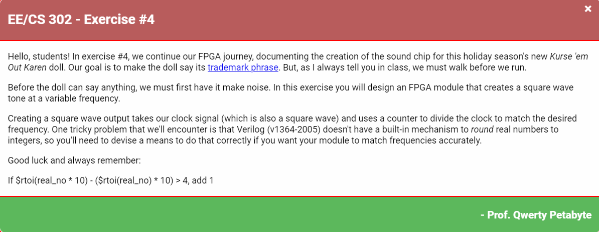
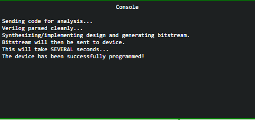
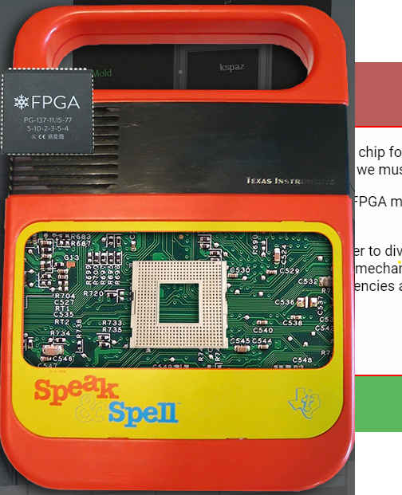
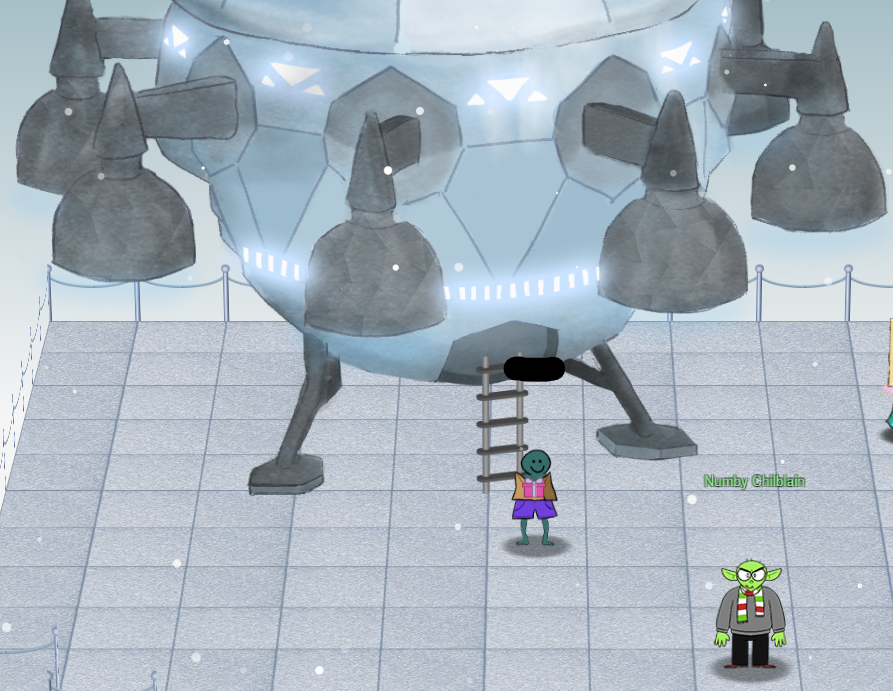
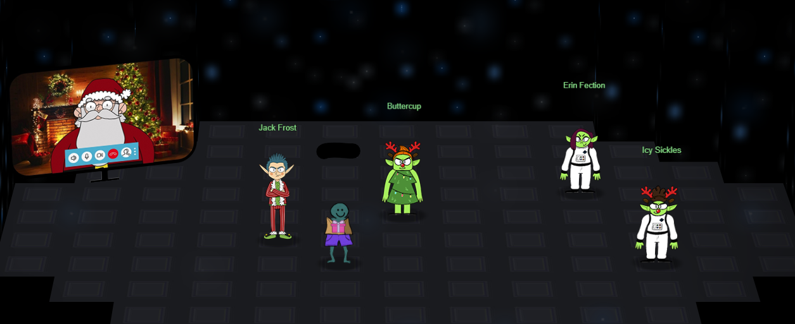

# Challenge 13: FPGA Programming

> Write your first FPGA program to make a doll sing. You might get some suggestions from Grody Goiterson, near Jack's elevator.

## The Hint

This is what Grody has to say:

> Hrmph. Snrack! Pthbthbthb.
> 
> Gnerphk. Well, on to business.
> 
> I'm Grody Goiterson. ... It's a family name.
> 
> So hey, this is the Frostavator. It runs on some logic chips... that fell out.
> 
> I put them back in, but I must have mixed them up, because it isn't working now.
> 
> If you don't know much about logic gates, it's something you should look up.
> 
> If you help me run the elevator, maybe I can help you with something else.
> 
> I'm pretty good with FPGAs, if that's worth something to ya'.
> 
> Oooo... That's it!
> 
> A deal's a deal. Let's talk FPGA.
> 
> First, did you know there are people who do this stuff for fun??
> 
> I mean, I'm more into picking on other trolls for fun, but whatever.
> 
> Also, that Prof. Petabyte guy is giving a talk about FPGAs. Weirdo.
> 
> So hey, good luck or whatever.

Oops - turns out we accidentally [completed this hint challenge earlier](../07_PrinterExploitation/README.md)!  On to the final challenge.

## The Main Challenge

Loading up the nearby FPGA terminal, we are greeted with the following:



Using verilog and the provided editor, we need to generate the appropriate square wave given an input frequency with our FPGA clock speed of 125MHz.

We can craft the following solution, and then submit each test frequency to ensure we have implemented correctly:
```
`timescale 1ns/1ns
module tone_generator (
    input clk,
    input rst,
    input [31:0] freq,
    output wave_out
);
    // ---- DO NOT CHANGE THE CODE ABOVE THIS LINE ---- 
    // ---- IT IS NECESSARY FOR AUTOMATED ANALYSIS ----
    // TODO: Add your code below. 
    // Remove the following line and add your own implementation. 

    integer counter = 0;
    reg sq_wave_reg = 0;
    assign wave_out = sq_wave_reg;
    localparam CLOCK_FREQUENCY = 125000000;
    
always @(posedge clk or posedge rst) begin
    if (rst) begin
        counter <= 32'h00;
        sq_wave_reg <= 1'b0;
    end
    
    else begin
        if (counter == 32'h00) begin
            sq_wave_reg <= sq_wave_reg ^ 1'b1;
            counter <= CLOCK_FREQUENCY/(freq/50) - 1;
        end
        else
            counter <= counter - 1;
        end
    end
endmodule
```

Once we have successfully tested each frequency, we can program the device to complete this challenge:



Once complete, we can access the nearby speak and spell, and plug in the FPGA chip:



Once we do this, a spaceship gloriously appears on the Frost Tower roof:



Once inside the spaceship, we are greeted by the follow folks:



Here's what each has to say:

### Icy Sickles

> We come in peace! I am Icy Sickles from ice Planet Frost.
> 
> Many centuries ago, we Frostian trolls sent an expedition to study your planet and peoples.
> 
> Jack Frost, scion of Planet Frost’s ruling family, captained that long-ago mission, which carried many hundreds of our people to your planet to conduct our research

### Erin Fection

> I am Erin Fection, the pilot of this interstellar spaceship.
> 
> Our first expedition established a base in the land of Oz, where our researchers became known as “Munchkins.”
> 
> We received a message from them long ago about a Great Schism, where the Frostian expedition split into two warring factions: Munchkins and Elves.
> 
> Thankfully, they managed to establish an uneasy peace by relocating the Elves to the North Pole.
> 
> Since then, we have heard nothing from the expedition. They went interstellar radio silent. Until NOW.

### Buttercup

> I am Buttercup, Princess of ice Planet Frost.
> 
> Thanks to your help, we received the message from the device summoning us back to Earth to address the recent unpleasantness.
> 
> We had no idea that Jack Frost would cause such trouble! We sincerely apologize.
> 
> We will take Jack back home to Planet Frost, along with all the other trolls.
> 
> The Elves and Munchkins, of course, can remain if they opt to do so.
> 
> Fear not, we WILL bring Jack and any guilty trolls to justice for their infractions. They will not bother your planet any longer.
> 
> Again, we apologize for all the troubles he has caused, and we sincerely THANK YOU for your help!
> 
> And, now that you've helped us solve everything, feel free to show off your skills with some swag - only for our victors!

### Jack Frost

> I was just having a little fun.  C'mon, man!
> 
> And, I was just getting started! I had such big plans!
> 
> I don't want to go home!!!

### Santa

> The Frostians have reached out to me via video link. They’ve explained to me all that has happened.
> 
> I’d like to thank you for your truly excellent work in foiling Jack’s plans and ensuring that he is finally brought to justice.
> 
> On behalf of all of us here at the North Pole, we wish you and yours a happy and healthy Holiday Season.
> 
> Thank you and HAPPY HOLIDAYS from me and all of the elves.
> 
> Ho Ho Ho!
